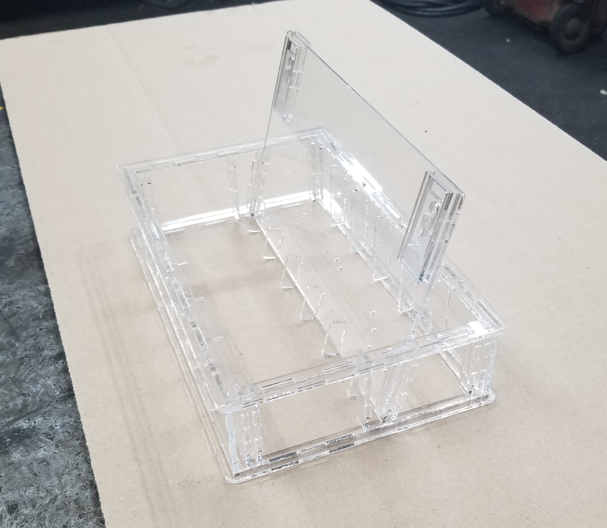
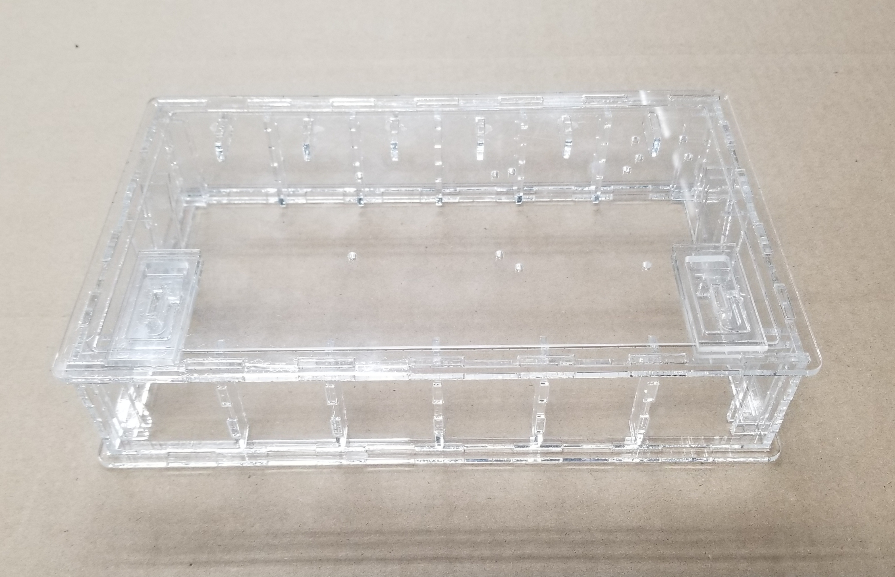
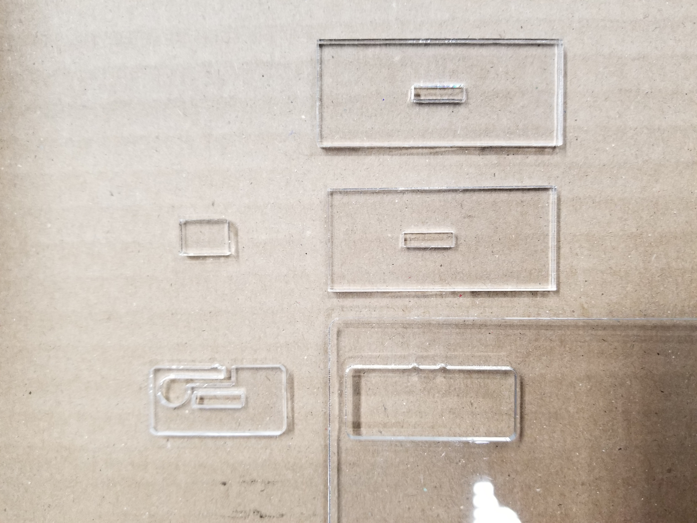
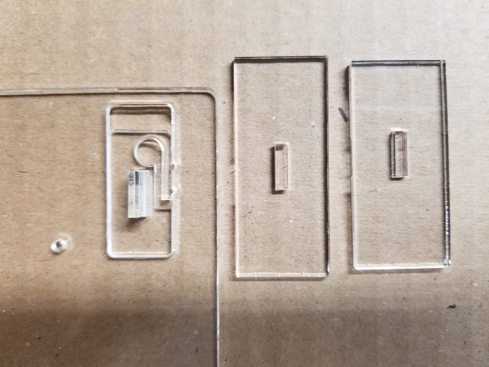
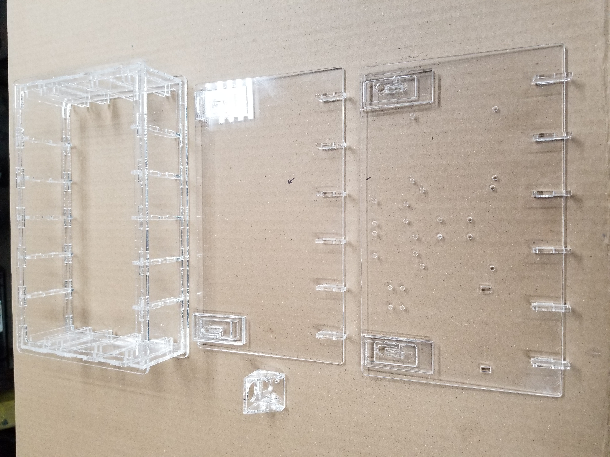

## Laser Cutting and Assembling the Transparent Case for the PrivateKeyVault  
  
This is what the case looks like opened.  

   
This is what the case looks like closed.    

Everything including the spring latches are laser cut.  

[Click here to return to the PrivateKeyVault main page for wiring and software installation instructions](https://github.com/johnshearing/PrivateKeyVault#privatekeyvault---make-instructions)  
**Or continue reading below for instrutions on how to cut and assemble the transparent case.**  

The CorelDraw files assume acrylic sheet 18 inches X 12 inches X .115 inch thick.  
Two sheets of acrylic are required to make one box.  
The files also assume that the kerf cut by the laser will be .007 inch wide.  

Each drawing makes half the parts necessary for the box.  
The only difference between the two drawings is that various layers have visibility and printing toggled on or off as required to print the respective sides of the box.  
So to make a complete box you will need to cut each of the two drawings.

  
  
  
  
  
  
  
  
  

As I improve the box I am likely to replace these files with updated drawings.  
So if you like a particular version of the box be sure to save it on your own hard drive.  

If you do not have a laser cutter and if you do not wish to use a local service provider then I will be happy to sell you a finished case for your PrivateKeyVault project.  
Contact johnshearing@gmail.com or gshearing@radioactiverf.com  

You are also free to set up your own business making these cases without giving me any money nor any credit.  
Hooray Open Source!  

Please feel free to suggest improvements and to contribute your own changes and original drawings if you have a different way to make this box.  

