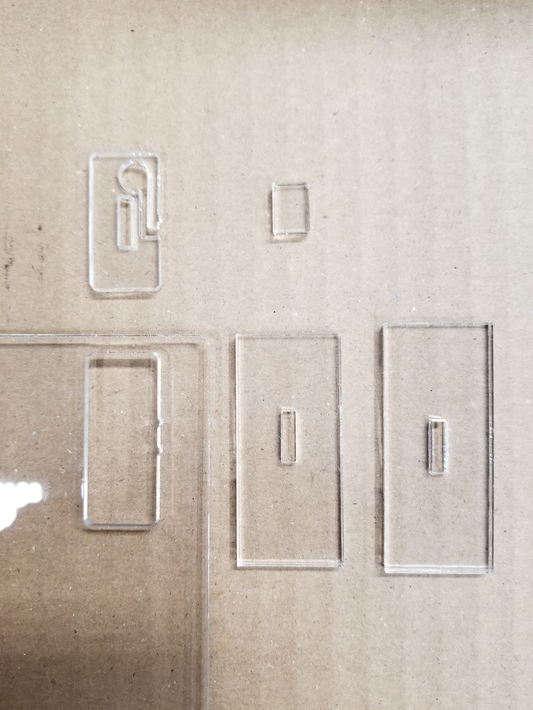
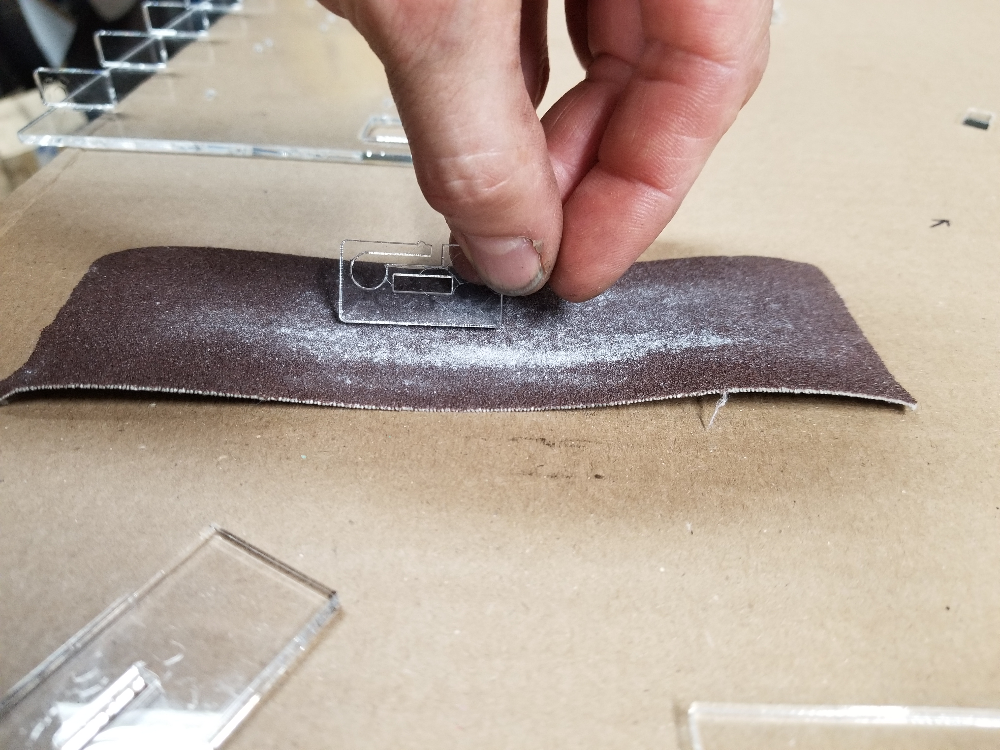
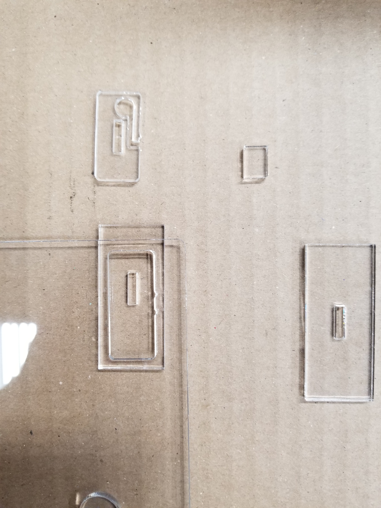
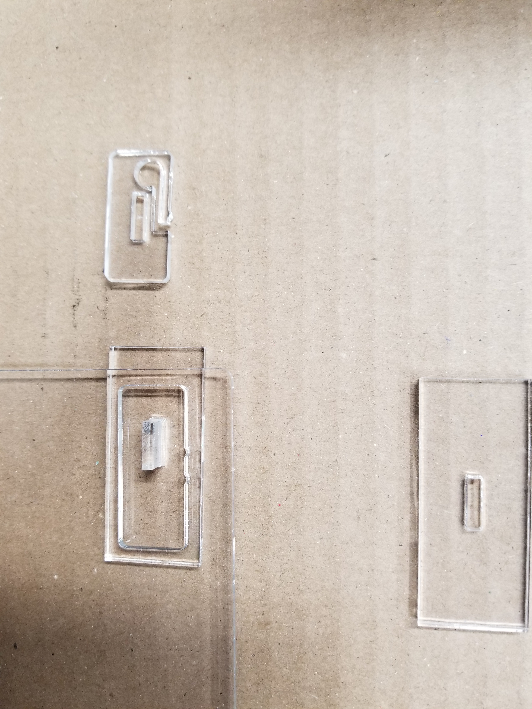
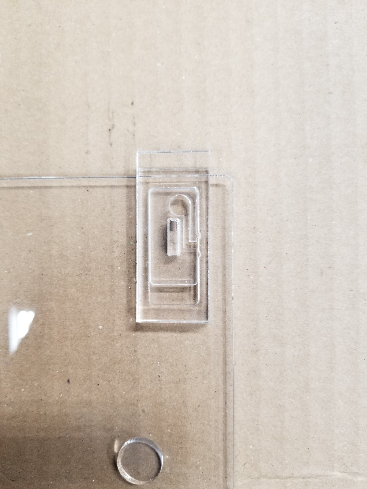
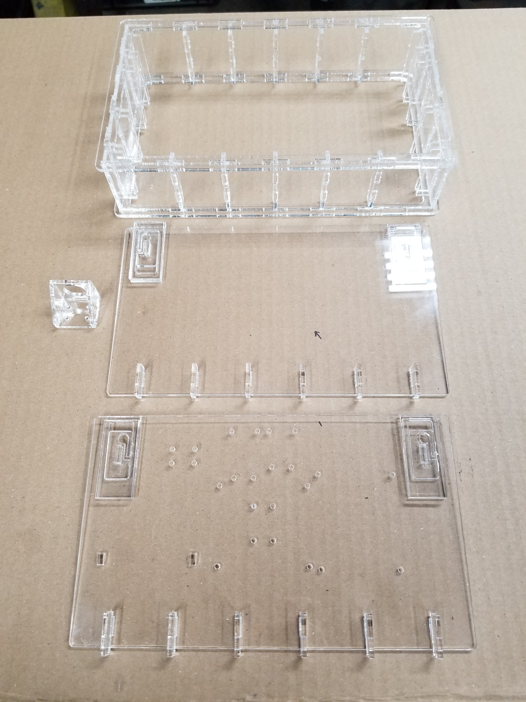

## Laser Cutting and Assembling the Transparent Case for the PrivateKeyVault  
  
This is what the case looks like opened.  

  

   
This is what the case looks like closed.    

Everything including the spring latches are laser cut.  

  

[Click here to return to the PrivateKeyVault main page for wiring and software installation instructions](https://github.com/johnshearing/PrivateKeyVault#privatekeyvault---make-instructions)  
**Or continue reading below for instrutions on how to cut and assemble the transparent case.**  

The CorelDraw files assume acrylic sheet 18 inches X 12 inches X .115 inch thick.  
Two sheets of acrylic are required to make one box.  
The files also assume that the kerf cut by the laser will be .007 inch wide.  

Each drawing makes half the parts necessary for the box.  
The only difference between the two drawings is that various layers have visibility and printing toggled on or off as required to print the respective sides of the box.  
So to make a complete box you will need to cut each of the two drawings.

  

This photo shows the parts cut from the first CorelDraw file.  
Don't forget to cut the second drawing too.  
Then you will have all the parts you need to assemble the box.  

  

  

This photo shows all the parts cut from both drawings.  
Some of the supports have already been chemically welded to the sides of the box.  
Also, you can see that the switch mount has been chemically welded together.  

[Click here to learn how to chemically weld acrylic](https://www.youtube.com/watch?v=hT6Ow_cBTps&feature=youtu.be)  

[Click here to order chemical welding products](https://www.tapplastics.com/product/repair_products/plastic_adhesives/tap_acrylic_cement/130)  
PrivateKeyVault has no finacial interest in the sale of these products.  

  

  

Here are all the parts required to make a latch.  
There are four latches on each box.  
There are two latches on the top and two latches on the bottom.  
That's because both the bottom and the top of the box can be opened.  

[This video shows how these types of latches are assembled](https://youtu.be/koxFgN304TI)  

  

  

Before fitting the latch together I first sand one side of the spring piece just a tiny bit until I get a nice sliding fit with a little bit of friction. I sand the four corners of this part just a tiny bit as well.  

  

  

In this photo the latch spring is placed inside the lid slot to check for a nice sliding fit with a little bit of friction.  
In the following photos I will show you how to assemble the latches.  
**Be sure to try and fit one of the latches together without welding it at first.**  
**Then try latching the box at one corner while holding the parts together with your fingers.**  
**This will ensure that you got the orientation of all the pieces right before permanently bonding them together**  

  

  

In this photo, the lid is upside down on the table and the longer of the two cover pieces is placed under the lid.  

  

  

Now the rectangular pin is inserted in the rectangular hole and chemically welded in place.   

  

  

In this photo, the latch spring is seen placed over the rectangular pin and chemical welding solvent is applied to the pin only.  
Also shown over the top of the spring latch is the bottom cover piece which is also chemically welded by applying solvent at the pin only.  
**Careful, watch the orientation of this last piece.**  
This last piece is not symentrical so the orientation matters.  
The distance from the rectangular hole to the ends is not the same.  
The end with the shorter distance to the rectangular hole must be placed over edge of the lid.  
Better get this right before applying the cement.  

  

  

  

As I improve the box I am likely to replace these files with updated drawings.  
So if you like a particular version of the box be sure to save it on your own hard drive.  

If you do not have a laser cutter and if you do not wish to use a local service provider then I will be happy to sell you a finished case for your PrivateKeyVault project.  
Contact johnshearing@gmail.com or gshearing@radioactiverf.com  

You are also free to set up your own business making these cases without giving me any money nor any credit.  
Hooray Open Source!  

Please feel free to suggest improvements and to contribute your own changes and original drawings if you have a different way to make this box.  

[Click here to return to the PrivateKeyVault main page for wiring and software installation instructions](https://github.com/johnshearing/PrivateKeyVault#privatekeyvault---make-instructions) 

