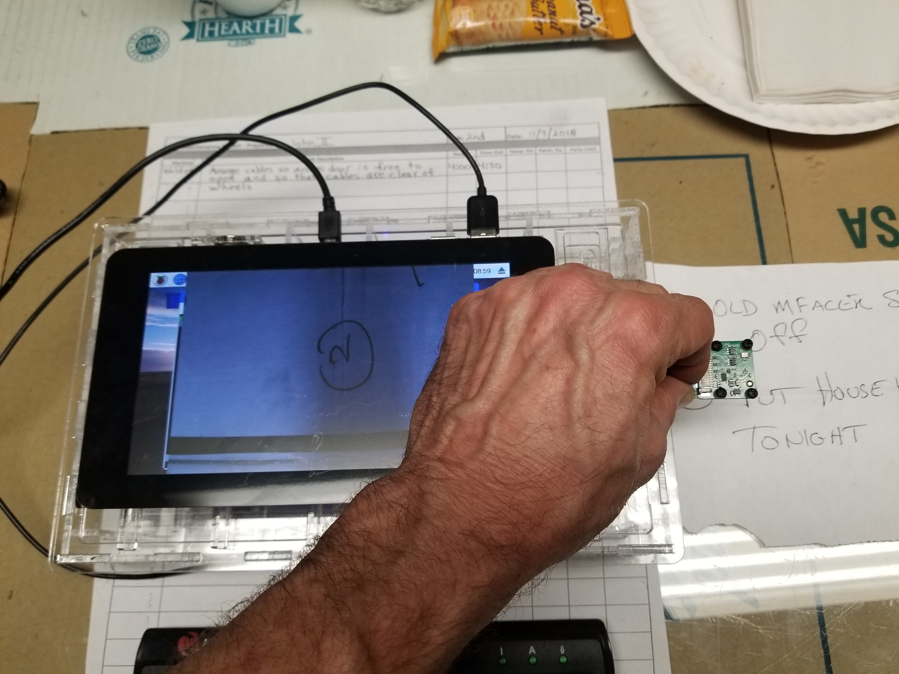
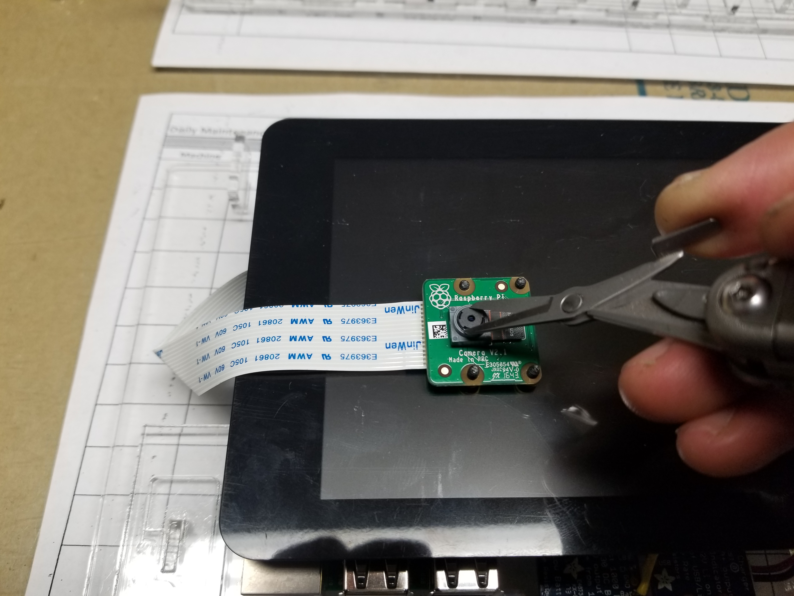

# PrivateKeyVault - [Click for Open Source Make Instructions](https://github.com/johnshearing/PrivateKeyVault#contents)  
### Airgapped raspberry pi computer with touch screen and camera  
### Featuring [LUKS full disk encryption](https://github.com/johnshearing/PrivateKeyVault#setup-luks-full-disk-encryption)  
### For [secure offline blockchain transactions](https://www.youtube.com/watch?v=_vA4tTLdL2M) and for [secure encrypted messaging](https://github.com/johnshearing/PrivateKeyVault#sending-an-encrypted-message)     
### [Move files across the airgap to other devices using QR-Codes](https://www.youtube.com/watch?v=3MwJOj3t8cI)  

  

Does anything a regular computer does and more.  

Full disk encryption keeps your private keys and personal information safe in case the device is stolen.  

Easily [clone the SD card](https://github.com/johnshearing/PrivateKeyVault#cloning-your-encrypted-sd-card-using-only-the-raspberry-pi) with all the encryption intact using only the Private Key Vault to do the cloning.  
So there is never a need to put your SD card into any other device.

Use it to:  
* [Securely move assets on the Ethereum blockchain without exposing your private keys to any other device.](https://www.youtube.com/watch?v=_vA4tTLdL2M)  
* Support for other blockchains is coming soon.  
* Securely read and edit all types of files behind the airgap where remote viewing and key logging is not possible.  
* No WiFi, No BlueTooth, No Cables, No USB ThumbDrives  
* [Move files across the airgap to other devices using QR-Codes](https://www.youtube.com/watch?v=3MwJOj3t8cI)  
* [GPG encrypted messaging is easy using this device.](https://github.com/johnshearing/PrivateKeyVault#sending-an-encrypted-message)  
* [Crypto-Journalism:](https://github.com/johnshearing/PrivateKeyVault/blob/master/Motivation/README.md#crypto-journalism) Now anyone can safely create a journalistic body of work and prove that they authored the entire work and that it has not been tampered with all while allowing the author to remain anonymous if he or she so chooses. Protected sources. No more fake news.  
* [Added Value For People In Developing Countries](https://github.com/johnshearing/PrivateKeyVault/blob/master/Motivation/README.md#added-value-for-people-in-developing-countries) The PrivateKeyVault is the cheapest computer you can have and it does double duty as a regular Internet connected computer simply by swapping out the encrypted SD card containing private information with another one set up for business, education, browsing, and casual use. Now, not only can everyone with Internet reach the blockchain - Finally they can learn to use it.  

The raspberry pi is not so much a thing as it is a community for getting the world on computers.  
The PrivateKeyVault is not so much a thing as it is a community for getting the world on blockchains.  

[What's In It For You?](https://github.com/johnshearing/PrivateKeyVault/tree/master/Motivation#whats-in-it-for-you)-----[What's In It For Me?](https://github.com/johnshearing/PrivateKeyVault/tree/master/Motivation#whats-in-it-for-me)-----[What's In It For Us?](https://github.com/johnshearing/PrivateKeyVault/tree/master/Motivation#whats-in-it-for-us)  

[What 2 Big Problems Does The PrivateKeyVault Solve That Hardware Wallets Cannot](https://github.com/johnshearing/PrivateKeyVault/blob/master/Motivation/README.md#what-2-big-problems-does-the-privatekeyvault-solve-that-hardware-wallets-cannot)

All you really need is a raspberry pi 2, a raspberry pi camera, an SD card and an AC power supply.  
You probably have a keyboard, mouse, and monitor laying around already.  
You are responsible for making sure there are no keyloggers or radio transmitters installed on any of these devices.  
[So click here if you just want to install the software on your raspberry pi](https://github.com/johnshearing/PrivateKeyVault#installing-the-os-and-setting-up-basic-functionality) 

Or continue reading if you would like to build the device as it is shown here.  

<hr>  

  

Computer and keyboard store in a transparent tamper resistant case which can not be opened without the owner knowing the device has been tampered with.  

This mitigates a [Maid in the Middle attack](https://github.com/johnshearing/PrivateKeyVault#preventing-the-evil-maid-or-maid-in-the-middle-attack)  

<hr>  

<a href="https://youtu.be/3MwJOj3t8cI" target="_blank"></a>  
[**Click on image above to see a YouTube video showing how files are passed out of the PrivateKeyVault to a phone.**](https://youtu.be/3MwJOj3t8cI)  
Transparent case facilitates transfer of files and transaction instructions out of the Vault across the airgap using a parade of qr-codes flashed across the screen which are received by the phone's camera. [The reverse process transfers files into the Vault from the phone. Click here to see that](https://youtu.be/JsmamD40nSQ). The device has no WiFi or BlueTooth and it is never connected to another computer - not by cable, not by thumbdrive, nor by any other means. All data moving in or out of the device stands for inspection and approval before crossing the airgap.
<hr>  

This is the fully open source documentation of the physical build and all the software.  
Disk images are forthcoming but you don't need them.  
You can build from scratch using these instructions.  

[CorelDraw files are included for laser cutting the case](https://github.com/johnshearing/PrivateKeyVault/tree/master/LaserCutterFiles)  
You don't need the transparent case for your PrivateKeyVault, but it's nice and it solves a lot of problems.  
All you really need is a Pi 2, a Pi camera, an SD card, and an AC adaptor for power.  
You probably have a mouse, screen and keyboard laying around already.   
You are responsible for making sure there are no keyloggers or radio transmitters installed on any of these devices.  
[So click here if you just want to install the software on your raspberry pi](https://github.com/johnshearing/PrivateKeyVault#installing-the-os-and-setting-up-basic-functionality)  

[Wiring Instructions](https://github.com/johnshearing/PrivateKeyVault/blob/master/WiringInstruction/README.md)  
As mentioned above you don't need battery power provided by all the special wiring. An AC adaptor is enough to power a basic raspberry pi. But battery power is nice so follow the link above if you would like battery power for your PrivateKeyVault.  

[This Video](https://www.youtube.com/watch?v=_vA4tTLdL2M) shows how an offline transaction is made on the Ethereum blockchain using the first prototype of the PrivateKeyVault. The procedure for making an offline transaction using the newer Vault or using a plain raspberry pi 2 is still the same so have a look if you want to see how an offline transaction is made.  

The PrivateKeyVault has a touchscreen on one side, and a camera on the back. It is battery powered or powered by AC. The unit is self-contained. Everything required to make keypairs, make keystore files, and make encrypted offline transaction instructions is built into the machine. So there is never a need to show your private keys to any other device. There is no WiFi nor Bluetooth - just a camera, a touch screen, and a keyboard for input and qr-codes displayed on the screen for output. Account numbers are scanned in through the camera in the form of qr-codes or entered manually through on the keyboard. Encrypted transaction instructions are displayed on the touch screen in the form of qr-codes to be scanned into a smartphone. A smartphone scans the qr-code containing the encrypted instructions and broadcasts those instructions to the Ethereum blockchain. If the miners can decrypt your transaction instructions using your public key then they know that you are in possession of the private key without needing to see it. It is easy and quick to use but is also as safe as any cold storage method because all work with the private keys are done on this air-gapped machine and never shown to any other device. And because you never plug into a computer as is required with other hardware wallets, you never have to worry about key loggers, remote viewing or remote control, nor do you need to worry about unknowingly transacting with a phony website pretending to be the digital wallet you normally use. The PrivateKeyVault is fully compatible with LUKS full disk encryption and instructions are provided below to encrypt the SD card containing your operating system and all your data. So the Vault can be used to store all your sensitive files and all your secret passwords. Finally, GPG comes installed with the Raspbian OS so the PrivateKeyVault can be used for secure encrypted messaging and for digitally signing documents. Any size file can be passed across the airgap via qr-codes so there is never a need to connect with other devices. The USB ports are only used to plug in the secure keyboard and for cloning the SD card containing the operating system and all your encrypted data.  

Encrypted messaging is much more secure when using the PrivateKeyVault compared with using a regular computer. That's because anyone could be remotely viewing a computer which is connected to the Internet. So what's the point of using encrypted messaging if someone can read the files on your computer after they have been decrypted for viewing. With the PrivateKeyVault, you don't decrypt the files until after they have crossed the airgap where remote control of your vault and remote viewing of your documents is not possible.  

The plan here is to teach people [for free via YouTube](https://www.youtube.com/watch?v=_vA4tTLdL2M) how to make and use the PrivateKeyVault.  
Using this documentation, you can build your own PrivateKeyVault.    
**Or you can set up your own business to do the same without giving us any money or recognition.**   
**Hooray Open Source!**    
 
Now that people all across the world can set up their own accounts on a super secure device in their own homes or businesses when they are alone, there is never any doubt that only they can command their accounts and that their accounts are safe from hackers thieves and oppressive governments.  

## Contents   
[Motivation](https://github.com/johnshearing/PrivateKeyVault/blob/master/Motivation/README.md#contents)  
* By providing a single secure device for managing secrets, I hope to facilitate wide scale adoption of blockchain technology.  
* [What's In It For You?](https://github.com/johnshearing/PrivateKeyVault/tree/master/Motivation#whats-in-it-for-you)  
* [What's In It For Me?](https://github.com/johnshearing/PrivateKeyVault/tree/master/Motivation#whats-in-it-for-me)  
* [What's In It For Us?](https://github.com/johnshearing/PrivateKeyVault/tree/master/Motivation#whats-in-it-for-us)  
* [What 2 Big Problems Does The PrivateKeyVault Solve That Hardware Wallets Cannot](https://github.com/johnshearing/PrivateKeyVault/blob/master/Motivation/README.md#what-2-big-problems-does-the-privatekeyvault-solve-that-hardware-wallets-cannot)  
* [Crypto-Journalism:](https://github.com/johnshearing/PrivateKeyVault/blob/master/Motivation/README.md#crypto-journalism)  
* [Added Value For People In Developing Countries](https://github.com/johnshearing/PrivateKeyVault/blob/master/Motivation/README.md#added-value-for-people-in-developing-countries)  

[Physically Building the PrivateKeyVault](https://github.com/johnshearing/PrivateKeyVault#physically-building-the-privatekeyvault)  
* [Parts List](https://github.com/johnshearing/PrivateKeyVault/blob/master/README.md#parts-list)  
* [Laser Cutting and Building the Transparent Case](https://github.com/johnshearing/PrivateKeyVault/tree/master/LaserCutterFiles/README.md)  
* [Wiring Instructions](https://github.com/johnshearing/PrivateKeyVault/blob/master/WiringInstruction/README.md)  

[Installing the OS and Setting Up Basic Functionality](https://github.com/johnshearing/PrivateKeyVault#installing-the-os-and-setting-up-basic-functionality)  
* [Write the image to the SD Card](https://github.com/johnshearing/PrivateKeyVault#write-the-image-to-the-sd-card)  
* [Booting the Pi For the First Time](https://github.com/johnshearing/PrivateKeyVault#booting-the-pi-for-the-first-time)  
* [Chose interfacing options, Expand File System](https://github.com/johnshearing/PrivateKeyVault#chose-interfacing-options-expand-file-system)  
* [Setting up VNC](https://github.com/johnshearing/PrivateKeyVault#setting-up-vnc)  
* [Switch to American keyboard layout if you are American](https://github.com/johnshearing/PrivateKeyVault#switch-to-american-keyboard-layout-if-you-are-american)  
* [Setup WiFi](https://github.com/johnshearing/PrivateKeyVault#setup-wifi)  
* [Purge Wolfram](https://github.com/johnshearing/PrivateKeyVault#purge-wolfram)  
* [Screen lockers are a Security Risk](https://github.com/johnshearing/PrivateKeyVault#screen-lockers-are-a-security-risk)  
* [Screen Blanking is a Security Risk](https://github.com/johnshearing/PrivateKeyVault#screen-blanking-is-a-security-risk)  
* [Prevent Xsession and Display Power Management from Blanking the Screen](https://github.com/johnshearing/PrivateKeyVault#prevent-xsession-and-display-power-management-from-blanking-the-screen)  
* [Using xset to working with Xsession and DPMS at runtime](https://github.com/johnshearing/PrivateKeyVault#using-xset-to-working-with-xsession-and-dpms-at-runtime)  
* [Setup This Custom Version of MyEtherWallet On Your Pi Which Has Been Optimized For This Project](https://github.com/johnshearing/PrivateKeyVault#setup-this-custom-version-of-myetherwallet-on-your-pi-which-has-been-optimized-for-this-project)  
* [Install the Camera and QR-Code reader](https://github.com/johnshearing/PrivateKeyVault#install-the-camera-and-qr-code-reader)  
* [Install a button on the Application Launch Bar to start the zbarcam QR-Code reader](https://github.com/johnshearing/PrivateKeyVault#install-a-button-on-the-application-launch-bar-to-start-the-zbarcam-qr-code-reader)  
* [Put another button on the Application Launch Bar to kill the zbarcam process](https://github.com/johnshearing/PrivateKeyVault#put-another-button-on-the-application-launch-bar-to-kill-the-zbarcam-process)  
* [Enable Right Click](https://github.com/johnshearing/PrivateKeyVault#enable-right-click)  
* [Install Nodejs and NPM](https://github.com/johnshearing/PrivateKeyVault#install-nodejs-and-npm)  
* [Install the npm packages required for working with Ethereum](https://github.com/johnshearing/PrivateKeyVault#install-the-npm-packages-required-for-working-with-ethereum)  
* [Get the program required to get a public address given a private key](https://github.com/johnshearing/PrivateKeyVault#get-the-program-required-to-get-a-public-address-given-a-private-key)  
* [Installing Software for Getting Text and Files Into and Out Of the PrivateKeyVault Using QR-Code](https://github.com/johnshearing/PrivateKeyVault#installing-software-for-getting-text-and-files-into-and-out-of-the-privatekeyvault-using-qr-code)  
* [Cloning Your Encrypted SD card Using Only the Raspberry Pi](https://github.com/johnshearing/PrivateKeyVault#cloning-your-encrypted-sd-card-using-only-the-raspberry-pi)  

[Security](https://github.com/johnshearing/PrivateKeyVault#security)  
* [Setup LUKS Full Disk Encryption](https://github.com/johnshearing/PrivateKeyVault#setup-luks-full-disk-encryption)   
* [Airgapping Your PrivateKeyVault](https://github.com/johnshearing/PrivateKeyVault#airgapping-your-privatekeyvault)    
* [Lock Down Your Pi](https://github.com/johnshearing/PrivateKeyVault#lock-down-your-pi)  
* [Change your password and user-name](https://github.com/johnshearing/PrivateKeyVault#change-your-password-and-user-name)  
* [Setting time without and Internet connection](https://github.com/johnshearing/PrivateKeyVault#setting-time-without-and-internet-connection)  
* [Deleting information on the SD card](https://github.com/johnshearing/PrivateKeyVault#deleting-information-on-the-sd-card)  

[Using Your PrivateKeyVault](https://github.com/johnshearing/PrivateKeyVault#using-your-privatekeyvault)  
* [Sending an Offline Transaction to the Ethereum Blockchain](https://github.com/johnshearing/PrivateKeyVault#sending-an-offline-transaction-to-the-ethereum-blockchain)  
* [Sending an Encrypted Message](https://github.com/johnshearing/PrivateKeyVault#sending-an-encrypted-message)   
* [Create your private key](https://github.com/johnshearing/PrivateKeyVault#create-your-private-key)  
* [Generating the public address or public key for use on the Ethereum Blockchain](https://github.com/johnshearing/PrivateKeyVault#generating-the-public-address-or-public-key-for-use-on-the-ethereum-blockchain)  
* [Check that your public and private key work together](https://github.com/johnshearing/PrivateKeyVault#check-that-your-public-and-private-key-work-together)  
* [Warning About Quantum Computers](https://github.com/johnshearing/PrivateKeyVault#warning-about-quantum-computers)  
* [Generate a Keystore File from a private key](https://github.com/johnshearing/PrivateKeyVault#generate-a-keystore-file-from-a-private-key)  
* [Preventing the Evil Maid Attack](https://github.com/johnshearing/PrivateKeyVault#preventing-the-evil-maid-or-maid-in-the-middle-attack)  
* [Conclusion](https://github.com/johnshearing/PrivateKeyVault#conclusion)  

[ToDo List](https://github.com/johnshearing/PrivateKeyVault#todo-list)  
* [Hardware Items Todo](https://github.com/johnshearing/PrivateKeyVault#hardware-items-todo)  
* [OS and Software Items To Work On](https://github.com/johnshearing/PrivateKeyVault#os-software-items-to-add-next-time)  
* [Changes to MyEtherWallet](https://github.com/johnshearing/PrivateKeyVault#changes-to-myetherwallet)  

[Scratch Pad of Notes](https://github.com/johnshearing/PrivateKeyVault#scratch-pad-of-notes)  

[Appendix](https://github.com/johnshearing/PrivateKeyVault#appendix)  
* [Linux Learning Resources](https://github.com/johnshearing/PrivateKeyVault#linux-learning-resources)
* [Commands for Working With Video at the Terminal](https://github.com/johnshearing/PrivateKeyVault#commands-for-working-with-video-at-the-terminal)
* [Often Used Github Commands](https://github.com/johnshearing/PrivateKeyVault#often-used-github-commands)  
* [Often Used GPG Commands](https://github.com/johnshearing/PrivateKeyVault#often-used-gpg-commands)    


### Physically Building the PrivateKeyVault  
The rest of this document shows you how to build and use the PrivateKeyVault.  

#### Parts List  
The items you will need are as follows. 
* [CorelDraw Files for Laser Cut Case](https://github.com/johnshearing/PrivateKeyVault/tree/master/LaserCutterFiles)    
  * [Qty (2) Acrylic Sheets - 18 inches X 12 inches X .115 inches thick](https://www.acmeplastics.com/cut-to-size-clear-acrylic-sheet-extruded)  
  * [Small BD-25/2 Hypo Applicator](https://www.tapplastics.com/product/repair_products/plastic_adhesives/hypo_type_solvent_cement_applicator/409)  
  * [TAP Acrylic Cement (4 oz)](https://www.tapplastics.com/product/repair_products/plastic_adhesives/tap_acrylic_cement/130)  
* Raspberry pi 2 board  
* Official raspberry pi 7 inch touchscreen  
* Official raspberry pi camera  
* 16 GB SD card  
* Ethernet cable  
* WiFi dongle for USB port    
* 32Mb thumbdrive   
* [Miniature Keyboard- Microcontroller-Friendly PS/2 and USB](https://www.adafruit.com/product/857)  
* [5V 2.5A Switching Power Supply with 20AWG MicroUSB Cable](https://www.adafruit.com/product/1995)    
* [Power Boost 1000 Charger](https://www.adafruit.com/product/2465)  
* [PowerBoost 1000 Basic - 5V USB Boost @ 1000mA from 1.8V+](https://www.adafruit.com/product/2030)  
* [Lithium Ion Battery Pack - 3.7V 6600mAh](https://www.adafruit.com/product/353)  
* [Rugged Metal On/Off Switch with Green LED Ring - 16mm Green On/Off](https://www.adafruit.com/product/482)  
* [BRASS M2.5 STANDOFFS FOR PI HATS - BLACK PLATED - PACK OF 2](https://www.adafruit.com/product/2336)  
  * These standoffs are Male at one end and female at the other.  
  * The body is 11 mm long and the male threads are 6 mm long. 
  * Buy 2 packs because you need 4 total.  
  * These are for stacking on top of the 12 mm long standoffs already on the touch screen for a total of 23 mm.  
* [Black Nylon Screw and Stand-off Set – M2.5 Thread](https://www.adafruit.com/product/3299)  
  * Items used are as follows.  
    * (Qty 4) nuts for fastening the switch mount to the case.  
    * (Qty 4) screws 10 mm long for fastening the switch mount to the case.   
    * (Qty 16) female female spacers 6 mm long to hold the circuit boards up off the case.  
    * (Qty 16) screws 6 mm long to secure the spacers to the case  
    * (Qty 16) screws 4 mm long to secure the circuit boards to the spacers.  
* 2.5 mm steel screws 6 mm long.  
  * You will need 4 to mount the touch screen.  
  * Plastic screws from kit above are fine for everything else.  
* A wire tie to hold the battery.  
* Heat shrink tubing 1/16 inch diameter.  
  * This will be used to cover solder joints when we shorten the battery wires.  
* A 3/32 inch in diameter drill bit.  
  * Two holes in camera board need to be drilled larger to pass 2.5 mm screws.  
* [USB DIY Slim Connector Shell - A-M Plug](https://www.adafruit.com/product/1827) for shortening keyboard cable.  
* [Jumper Wires Premium 6" F/F - 20 AWG (10 Pack)](https://www.sparkfun.com/products/11710)  
* [Wire, PVC, Red, 20 AWG, 25 ft, 7.6 m](https://www.newark.com/webapp/wcs/stores/servlet/ProductDisplay?catalogId=10001&langId=-1&urlRequestType=Base&partNumber=68X4831&storeId=10194)  
* [Wire, PVC, Black, 20 AWG, 25 ft, 7.6 m](https://www.newark.com/webapp/wcs/stores/servlet/ProductDisplay?catalogId=10001&langId=-1&urlRequestType=Base&partNumber=68X4829&storeId=10194)  


#### Laser Cutting and Building the Transparent Case  
* [CorelDraw files for laser cutting the case and assembly instructions are found here](https://github.com/johnshearing/PrivateKeyVault/tree/master/LaserCutterFiles/README.md)    

#### Wiring Instructions  
* [Wiring Instructions](https://github.com/johnshearing/PrivateKeyVault/blob/master/WiringInstruction/README.md)


### Installing the OS and Setting Up Basic Functionality.  

The following is the written tutorial from which these notes are made.  
[Setup Headless, Security, WiFi, VNC, Camera, and Much More](http://thezanshow.com/electronics-tutorials/raspberry-pi)

The following YouTube playlist follows the written tutorial exactly.  
[Setup Headless, Security, WiFi, VNC, Camera - YouTube Playlist](https://www.youtube.com/watch?v=RlUhDUJfTe8&index=1&list=PLNnwglGGYoTvy37TSGFlv-aFkpg7owWrE)  

Make a folder and name it perhaps **PiSetup**  

[Download Win32 Disk Imager found here](https://sourceforge.net/projects/win32diskimager/) to **PiSetup** and install it to the same directory.  Source forge does not seem to offer a hash to check that the downloaded file has not been tampered with but the application does generate hashes so you can use it to check the validity of other files. When using it for that purpose, be careful not to accidentally trash your C: drive.

[Download 7-zip found here](http://www.7-zip.org/) to **PiSetup**and install it.  

[Download Raspbian Jessie with Pixel found here](https://downloads.raspberrypi.org/raspbian/images/raspbian-2017-07-05/) to **PiSetup**  
**Do not** download Stretch (the latest version of raspbian). As of this writing. I have not yet heard of anyone achiving LUKS full disk encryption when using Stretch as the operating system without using a second Linux computer to do the encryption.   

If you want to, you can use the Win32 Disk Imager to check that the SHA1 hash of your zip file is the same as the SHA1 hash listed on the raspberry pi website (this is the easiest option). Or you can use NodeJS at the command line to check that the downloaded zip file has not been tampered with. This takes a bit more time but it is good to have two completely different methods to hash a file.  
Assuming NodeJS is installed - Open your favorite command line interpreter. I use PowerShell.  

`cd` to the directory where downloaded zip file is located.  

Start node by executing the following command.   
`node`  

Then execute the following commands one at a time.  
Change the file name parameter to the name of the zip file before executing the last command, of course.  

```
var fs = require('fs')   

var crypto = require('crypto')  

fs.createReadStream('/some/file/name.zip').pipe(crypto.createHash('sha1').setEncoding('hex')).on('finish', function () {
  console.log(this.read()) //the hash
})
```  
After a minute or two, the hash of the zip file will appear at the console output. Be patient.  
If you are satisfied that the SHA1 hashes match then extract the file to the same directory using 7-zip.   

[Download VNC client found here](https://www.realvnc.com/download/viewer/) to **PiSetup**  
No install is required.  
The SHA256 hash is given just below the download button. Node does not have native ability to run a SHA256 hash so I found this package **Hasha** which seem to be very popular. Keep in mind that The Win32 Disk Imager can accomplish the same thing but it's good to have several different methods of getting a hash.  

Installing and using Hasha if you want to:  
Using your favorite Command Line interpreter, `cd` into your **PiSetup** directory.  

Assuming NPM is installed, Initialize a project.  
This creates a package.json file which is necessary to install packages.  
Execute the following command.  
`npm init`  
Then answer the questions at the command line.  

Next install the hasha package.  
Execute the following command.  
`npm install --save hasha`  

Then execute the following commands one at a time.  
**The file name parameter will be different for you of course.**  
```   
const hasha = require('hasha');  
hasha.fromFileSync('VNC-Viewer-6.1.1-Windows-64bit.exe', {algorithm: 'sha256'});  
```  
The hash will appear at the console output.  
If you are satisfied that the hash matches what is published then continue.  

Look up Hasha on NPM to learn about other ways to use this utility.  

#### Write the image to the SD Card  

Purchase the highest quality SD card that you can afford.  
I can not make a recommendation except to say do some research online.  

Ensure that the write protection switch on the SD card adaptor is set to allow writing to the SD card.  

Insert SD card into laptop.  

Open Win32 Disk Imager.  

Point the imager app at the image file (Raspian).  

Point the imager at the target SD card by selecting it from the **Device** pulldown menu.  
All data currently on the SD card will be lost when the Raspian image file is installed on the SD card.  
Be very careful **NOT** to target your hard drive.  

Click on the **Write** button and then click **Yes** button.  

The previously untitled SD card is now called boot.  

The disk imager has the ability to create hashes if required.  

#### Booting the Pi For the First Time  
Now eject the SD card from your computer and insert it into the pi.  

Insert one end of the Ethernet cable into the pi and the other end into your computer.  
Energize the pi and let it cook for a minute or more.  
Future boots will go much faster.   

Important Note: When using your finger to resize windows: tap **on the title bar of the window near an edge** until the cursor changes to become a two headed arrow with heads pointing in opposite directions. Now you will know that the window is ready to be resized. Touch the cursor again and hold your finger for a short moment on the cursor. Now move your finger to resize the window. If you do not follow this method exactly then resizing the window can be maddeningly difficult.  

#### Chose interfacing options, Expand File System.  
Open a Terminal window by clicking the Terminal Window icon on the taskbar.  

Next type: `sudo raspi-config` at the command prompt and press **Enter**  
You will only be able to access this utility from the keyboard. The mouse will not work.  

First, change the password. Make it difficult to guess and write it down so you don't forget it.  

Then under **Boot Options** select Option **B1 DeskTop / CLI**.  
When that screen appears select option **B3 DeskTop GUI requiring user to login**  

Next under **Interfacing Options**, Enable VNC and Camera.  

Under **Advanced Options**, Select **Expand File System**.  

Select **Finish** and accept the offer to reboot.     

#### Setting up VNC  
VNC can be used to configure your pi and to transfer files from PC.  

Make sure there is an Ethernet cable plugged in between your computer and your pi.  
Get the IP address of your pi by taping on the Networking icon near the upper right of the Task Bar.  
Double click on **VNC-Viewer-6.1.1-Windows-64bit.exe** in the **PiSetup** folder on your computer.  
Enter the IP address of your pi into the VNC window on your PC and press **Enter** on the keyboard.  
Your remote VNC session will start.  
Remember you can find out your Ethernet IP address by clicking the WiFi icon one or more times slowly until it shows up. The IP address for the Ethernet connection will be labeled **eth0**. This is the one you want to enter into the VNC dialog box on your computer. The IP address associated with your WiFi dongle will be labeled **wlan0**. This is for access to the Internet - it is not used for connecting to your computer.  

You may get some security questions the first time you login with VNC because the VNC client has never seen that host before. Select responses that indicate that you trust the pi and you will be allowed to continue.  

When prompted, login in with the username pi and with the new password you just created.    

#### Change the System Font Size and Type  
Buttons on system dialog boxes will be off the screen and you will not be able to access them unless you set the system font size.  
You will have to make the font small at first and then you can make it large again.  
This forces the system to put values in some configuration file where currently none exist.  
Press the **CTRL+ESC** to open the main menu. Or if you want click on the raspberry.   
Arrow down to **Preferences** and then select the **Appearance Settings** menu option.  
Click on the **System** tab.  
Select a small font and then click the **OK** button.  
Then do the same thing again but select a larger font  
Roboto 12 is the font I use.  
This seems to be the largest font I can have that will allow the entire dialog box to fit on the screen.  

#### Switch to American keyboard layout if you are American  
Open the raspberry pi's command line interpreter.  
It's the forth icon from the top left on the menu bar.  
At the command line, execute the following line of code.  
`sudo leafpad /etc/default/keyboard`  
Then change `XKBLAYOUT="gb"` to `XKBLAYOUT="us"`  

#### Setup WiFi    
Insert your WiFi dongle and reboot the pi.  
After the pi reboots, you will see a WiFi icon in the task bar near the right side.  
You will recognize the icon as a blue up arrow and a down arrow next to each other.  
If the icon does not appear then pulling out the dongle and reinserting will probably fix your problem.  
If you are still having trouble you can check that your WiFi hub is broadcasting and reciving at a slow enough bandwith for the dongle you are using.  
Click on the icon.  
After a few seconds your wireless router will appear in a dropdown list.  
Click on the list item representing your router.  
A dialog box will appear asking for your router's password.  
Enter the password and the pi will connect to the Internet through your router.  
It will now be possible to use the browser and to download files from the Internet.   

Now start a new VNC session between this computer and your raspberry pi via Ethernet cable.  
This will allow you to copy and paste commands from this document into the raspberry pi's command line interpreter.  

#### Purge Wolfram
Purge the Wolfram engine from your pi to save space on the SD card.  
Execute the following line of code in your pi's terminal window:  
`sudo apt-get purge wolfram-engine`  

Running the following command in the terminal window will get you even more free space.  
`apt-get autoremove`  

#### Screen lockers are a Security Risk  
Logging out and then back in again is accomplished by selecting the **Shutdown** option on the main menu and then selecting the **Logout** button. This will log the user out and then present the user with a login screen to start a new session if desired. This is fail safe because if the login service crashes or is hacked no one is logged in. But if a screen lock is used then the user is still logged in so if the screen lock crashes or is hacked then the users's session becomes accessable to the attacker. Obviously, applications are closed when the user logs out so logging out is a bit inconvenient when compared with a screen saver but the extra security makes the effort worthwhile. [Jamie Zawinski explains in detail here](https://www.jwz.org/xscreensaver/toolkits.html)  

#### Screen Blanking is a Security Risk  
Screen blanking is a security risk because if a screen goes dark then the user might mistakenly think that the machine is off when in fact a mere touch will bring the screen back to life with the users session available.  

#### Prevent Xsession and Display Power Management from Blanking the Screen:  
Run the following command in xTerminal to edit lightdm.conf:  
`sudo leafpad /etc/lightdm/lightdm.conf`  

in section [Seat:*] add or adjust line to say:  
`xserver-command=X -s 0 -dpms`  

I was having trouble getting the pi to stop blanking the screen until I put the above line of code in every section of the file.  
Now the screen stays on all the time.  
That's what I want.  

#### Using xset to working with Xsession and DPMS at runtime:  
At the pi's command line interface (xTerminal) you could execute the following to accomplish the same thing as above but it will only be in effect for the current session.  
`xset s off -dpms`  

To view your Xsession settings, use this command:  
`xset q` 

[More on xset, Xsession, and DPMS here](https://wiki.archlinux.org/index.php/Display_Power_Management_Signaling)   

#### Setup This Custom Version of MyEtherWallet On Your Pi Which Has Been Optimized For This Project  
Using the Chrome Browser on your Raspberry Pi navigate to the following repository:  
https://github.com/johnshearing/MyEtherWalletOffline    

We are going to download the repository onto your raspberry pi.  
Look on the right side and scroll down a bit until you see a green button that reads **Clone or download**  
Click on that button.  
A small popup window will appear under the button.  
Click on the link which reads **Download ZIP**  
The ZIP file will download into your Downloads folder.  

Now we are going to extract the files.  
Now open your file manager by clicking on the third icon from the upper left on your Start Bar.  
The icon looks like a folder. Click on that.  
Next navigate to the downloads folder.  
You will see an icon that reads **MyEtherWalletOffline-master.zip**  
Double click on that.  
An application called Xarchiver will open.  
Xarchiver looks a lot like a file manager.  
We will use Xarchiver to extract files from the ZIP file we just downloaded.  
Click on the **Action** menu option.  
Then click on the **Extract** menu item.  
A dialog box will open entitled **Extract Files**  
Click on the button on the bottom right labeled **Extract**  
Wait a few seconds for the Xarchiver to extract the file and then close the Xarchiver applicaition.  

You will now see a new folder next to the zip file that you downloaded.  
This new folder is labeled **MyEtherWalletOffline-master**  
Double click on this new folder to open it.  
Now you will see a folder labeled **dist**.  
We are going to rename this folder **MEW**.  
Click once on the **dist** folder just to highlight it.  
Then open the **Edit** menu at the upper left and select the **Rename** menu option.  
When the **Rename** dialog box opens, rename the **dist** folder **MEW**.   

Finally we are going to move the newly named **MEW** folder up to the **pi** directory.  
Click the newly named **MEW** folder once just to highlight it.  
Then on the **Edit** menu select **Cut**.  
Now navigate up to the **pi** folder and select **Paste** from the Edit menu.  
The **MEW** folder has now been moved up into the **pi** folder.  

If you want to, you may now go back to your **Downloads** folder and delete the ZIP file: **MyEtherWalletOffline-master.zip**.  
You may also delete the extracted folder: **MyEtherWalletOffline-master**.  
You will not need these anymore.  
To delete a file or folder - click on the item and then under the Edit Menu click Remove.  

**Do not change anything inside the MEW folder**  
If you change anything inside the MEW folder it may break the application.  

#### Change the Chrome Browser Settings So That MyEtherWallet Will Run When Chrome Starts.  
Open the **Chrome** browser by clicking the second icon from the top left on the **Start Bar**.  
The icon is round and blue and with lines of latitude and Longitude. It looks like a globe.  
Click on that to open the browser.   

Click the browser control icon at the right - it's the vertical ellipsis. It's three dots arranged vertically.  
The **Control** menu will open.  
Select settings from the menu options. This will bring you to the settings page.  
On the **On Startup** options: select the radio button marked "Open a specific page or set of pages".  
Then click the link next to the radio button marked "Set pages".  
Assuming you downloaded and extracted MyEtherWallet into the same directory I did then entering the following into the **Startup Pages** dialog box will cause your local copy of MyEtherWallet to load.  
`file:///home/pi/MEW/index.html#offline-transaction`  
Now close the browser and open it again.  
When it opens again the **MyEtherWallet** application should be open.  

**Important**  
Don't put any private keys into MyEtherWallet until you have finished working through this document and you have committed to disconnecting your pi from the Internet. Once your private keys have been entered into the pi you must **never ever** connect the pi to the Internet nor to any other device. If you do, you will likely lose all your ether.  
**You Have Been Warned**  

#### Setup MyEtherWallet Using the Original Repository.  
**Normal users can skip this section.**  
This section is only for developers and users who do not want to use my customized fork of the MyEtherWallet repository. If you have already installed my fork of the MyEtherWallet repository as instructed in the last section of this document then you can skip this section and go on to the next.  
[For developers and users, the latest MEW project unaltered by me is found here](https://github.com/kvhnuke/etherwallet#download-the-latest-release-httpsgithubcomkvhnukeetherwalletreleaseslatest).  

Read everything on that page and then click on the link near the top of the readme file entitled **Download the Latest Release**   

Developers will download the source code to their computers and will follow the developer's instructions on that webpage.  
```
Here is the gist of it from Taylor at MEW:  
clone the repo  
enter that folder  
install node / npm and then do npm install gulp in your command line.  
Now you can make changes via the /app/ folder and it will recompile and show up in the dist/index.html.  
If you want to remove big pieces, you can adjust things in app/scripts/main.js or app/layouts/index.html  
If you want to adjust items on certain pages, you can remove via the components in app/includes/  
And then you have a mess of styles in /app/styles/  
running gulp prep will compile it all down using the ES5 babel transform. You need this if you are using slightly older browsers.   
```

Users will download the compiled version (dist-vX.X.X.X.zip) directly to their pi and unzip it.  
Keep all the unzipped files together as they were when they were unzipped on the pi.  
Do not move them around.  
Leave them undisturbed.  

I find that the easiest way to install MEW on the pi is to use the pi's browser and go to MyEtherWallet.com.  
Then scroll to the bottom of the webpage and click on the link entitled **Latest Release**  
Download the distribution zip file and then move the whole zip file into a folder which I name **MEW**.  
Then unzip the file into this same folder.  

Be very careful when going to MyEtherWallet.com that you type the WebAddress in yourself or use one of your own bookmarks. If you use someone else's link then you will find yourself at a counterfeit website that will steal your private keys and take all your ether. Remember it's myetherwallet.com not .org, not .net or dot anything else. Also, there have been counterfeit websites that use the numeral 1 instead of the letter l in URL. Using this site will cause you to lose all your ether. For these reasons you should always type the URL into your browser yourself, or use one of your own bookmarks.  
**You have been warned**  

To use MyEtherWallet on your pi, run index.html in your browser.  
Assuming you downloaded and extracted MyEtherWallet into the same directory I did then the following command in the terminal window will run it.  
`chromium-browser --app=URL file:///home/pi/MEW/index.html#offline-transaction`  

Don't put any private keys into MyEtherWallet until you have finished working through this document and you have committed to disconnecting your pi from the Internet. Once your private keys have been entered into the pi you must **never ever** connect the pi to the Internet nor to any other device. If you do, you will likely lose all your ether.  
**You Have Been Warned**

#### Install the Camera and QR-Code reader  
If you have been following along then the camera was already enabled using `sudo raspi-config`  
Now you will need to focus the camera. This is because you will be using the camera to take pictures and videos of qr-codes on your phone which will be held about 2 3/8 inches from your camera. This really matters if you are using the camera to read qr-codes. You simply will not be able to read qr-codes with your camera if it is not focused for a distance of 2 3/8 inches.  

    

You will need to remove the touch screen in order to remove the camera and then temporarily put it back together as show in the photo above in order to focus the camera.  

When you have the Vault powered up again in this new configuration execute the following command at the terminal window to set up the camera focus  
`raspistill -t 0 --rotation 270`  
Now the touchscreen will show what the camera sees.  
Adjust the focus to about 2 3/8 inches as measured from lens to object.  
The next photo shows how to make the adjustment.  

<hr>  

    

The focus comes set at infinity.  
Small sharp sissors are good for turning the retaining ring.  
Counter clock wise moves the focus closer.  
Some of the cameras come from the vendor with a dot of glue on the retaining ring to keep the focus set at infinity.  
If the dot of glue is present then some force will be required to break the dots of glue that hold the retaining ring in place.  
Keep turning the retaining ring and checking focus until focus is sharp at 2 3/8 inches.  
When focus is good shut down and power off and then remount the camera at it's normal position.  
It might be good to put a tiny dot of super glue on the retaining ring when finished adjusting the focus but I haven't tried doing it.  
To see what is possible with raspistill execute `raspistill --help`  

<hr>  


Install zbarcam. This is the program that decodes QR code.  
Run the following command in the pi's terminal window one at a time.  
`sudo apt-get update`  
`sudo apt-get install zbar-tools`  

Download and compile "crikey.  
This takes output from the zbarcam and pipes it to the active input control.    
`sudo apt-get install libx11-dev x11proto-xext-dev libxt-dev libxtst-dev`  
`wget http://www.shallowsky.com/software/crikey/crikey-0.8.3.tar.gz`  
`tar -xzf crikey-0.8.3.tar.gz`  
`cd crikey-0.8.3`  
`make`  
`sudo cp crikey /usr/local/bin`  
Help with crikey can be found by emailing fmft71 at yahoo dot es  

Execute the following line of code in the pi's terminal window to make the pi cam visible to zbarcam.  
`sudo modprobe bcm2835-v4l2`  

Even better, load the module at every boot  
Add `bcm2835-v4l2` to the file **/etc/modules**  

I like to use the LeafPad text editor.
Enter the following command in the pi's terminal window to open the correct file for adding the code above.  
`sudo leafpad /etc/modules`  

Reboot your pi to see the changes take effect.  

Execute the following command in the pi's terminal window to start zbarcam  
`zbarcam --nodisplay --raw --quiet -Sdisable -Sqrcode.enable --verbose --prescale=640x480  | crikey -i`   
Pressing `ctrl + C` will stop the zbarcam.  

#### Install a button on the Application Launch Bar to start the zbarcam QR-Code reader  
Three files are involved:  
[My source of information on this topic can be found here](http://orbisvitae.com/ubbthreads/ubbthreads.php?ubb=showflat&Number=81166#Post81166)  

First, create a file in the pi directory called ld_qr_reader.sh  
The name stands for Load QR-Code Reader.  
The location of the file is important.  
Using the Terminal Window, execute the following command:  
`sudo leafpad /home/pi/ld_qr_reader.sh`  

Paste the following into the file and save it to the pi directory:  
```
#/usr/bin/sh

zbarcam --nodisplay --raw --quiet -Sdisable -Sqrcode.enable --verbose --prescale=640x480  | crikey -i

```

Next, Grant read, write, and execute permissions to everyone.  
Execute the following command in the pi's terminal window:  
`sudo chmod 777 /home/pi/ld_qr_reader.sh`  

Second File: Get two nice icons from the internet. One you will click on to start the QR-Code reader and the other will be used to stop it after getting a good read.   
Save these to the following directory:  
`/usr/share/icons/`  
Be sure to convert them to the png format using a paint like program before saving it to the pi.  
I called my icon **QR-Code.png**  
[It can be found here](https://github.com/johnshearing/MyEtherWalletOffline/blob/master/QR-Code.png)  
This is already in the correct format.  
[The other icon - Kill_QR-Code.png is found here](https://github.com/johnshearing/MyEtherWalletOffline/blob/master/Kill_QR-Code.png)  

We will refer to the icons later by the names already given to them.  
Be sure to save these in the `/usr/share/icons/` directory.  

Next, Grant read, write, and execute permissions to all users.  
Execute the following commands in the pi's terminal window:  
`sudo chmod 777 /usr/share/icons/QR-Code.png`
`sudo chmod 777 /usr/share/icons/Kill_QR-Code.png`

Third File: The Desktop file - This is file determines the properties of the short cut.  
Execute the following command in the pi's terminal window   
`sudo leafpad /home/pi/.local/share/applications/ld_qr_reader.desktop`  
It could have been named anything but the location maters.  

Paste the following code into the file:  
```
[Desktop Entry]
Name=Start QR_Code Reader
Comment=Start the QR_Code reader
Icon=/usr/share/icons/QR-Code.png
Exec=sudo /home/pi/ld_qr_reader.sh
Type=Application
Encoding=UTF-8
Terminal=false
Categories=Utility;
```

Next, Grant read, write, and execute permissions to every one.  
Execute the following command in the pi's terminal window:  
`sudo chmod 777 /home/pi/.local/share/applications/ld_qr_reader.desktop`

Reboot the pi and then right click on the Application Launch Bar so that you can edit its properties in the same way that was shown for the Florence virtual keyboard above.  
Select your new desktop item (It can be found in accessories) and place it onto the Application Launch Bar.  
 
#### Put another button on the Application Launch Bar to kill the zbarcam process.  
Three files are involved:  

[This article covers killing processes. Use killall and the name of the program](https://www.raspberrypi.org/magpi/command-line-pi/)  

The First File:
Make a copy of your scanner icon and mark it up with the paint program to signify turning off the QR-Code scanner.  
Save it to the pi in the following directory:  
If you have been following along then this is already done in the previous step.  
`/usr/share/icons/`  
Be sure to convert it to the png format using a paint like program before saving it to the pi.  
I called mine Kill_QR-Code.png  
We will refer to the icon by this name.  

Next, Grant read, write, and execute permissions to every one.  
Using the pi's terminal window, navigate to the `/usr/share/icons/` directory.
Then execute the following command in the pi's terminal window:  
`sudo chmod 777 Kill_QR-Code.png`  
Again, this has already been done if you have been following along.  

Second file:  
Next, create a file in the pi directory called kill_qr_reader.sh  
The name stands for Kill QR-Code Reader.  
We will refer to the file by this name.  
The location of the file is important too.  
Using the Terminal Window, navigate to the pi directory and execute the following command.  
`sudo leafpad /home/pi/kill_qr_reader.sh`  

Paste the following into the file and save it to the pi directory:  
```
#/usr/bin/sh

sudo killall zbarcam

```  

Next, Grant read, write, and execute permissions to every one.  
Execute the following command in the pi's terminal window:  
`sudo chmod 777 /home/pi/kill_qr_reader.sh` 

Third File: The Desktop file - This is file determines the properties of the short cut.  
Execute the following command in the pi's terminal window   
`sudo leafpad /home/pi/.local/share/applications/kill_qr_reader.desktop`  
It could have been named anything but the location maters.  

Paste the following code into the file:  
```
[Desktop Entry]
Name=Stop QR_Code Reader
Comment=Stop the QR_Code reader
Icon=/usr/share/icons/Kill_QR-Code.png
Exec=sudo /home/pi/kill_qr_reader.sh
Type=Application
Encoding=UTF-8
Terminal=false
Categories=Utility;
```  

Next, Grant read, write, and execute permissions to every one.  
Execute the following command in the pi's terminal window:  
`sudo chmod 777 /home/pi/.local/share/applications/kill_qr_reader.desktop` 

Reboot the pi and then right click on the Application Launch Bar so that you can edit its properties in the same way that was shown for the Florence virtual keyboard above.  
Select your new desktop item (It can be found in accessories) and place it onto the Application Launch Bar.  

At some point in the future it might fun to have the buttons which turn on and off the QR-Code scanner behave like radio buttons where the active button is depressed.    
[This article covers changing the Application Launch Bar programaticlly](https://unix.stackexchange.com/questions/177386/how-can-i-add-applications-to-the-lxpanel-application-launch-bar-via-cli)   

#### ENABLE RIGHT CLICK  

Normally right click functionality on a touch screen is achieved with a long press on the screen. However, the official 7 inch raspberry pi touch screen does not support that although long press to get the context sensitive menu is available in the pi's Chrome Browser. To get the context sensitive menu everywhere else there is an application called twofing. As you have probably guessed pressing two fingers on the touch screen initiates the context sensitive menu.  

Here is the complete installation instructions from scratch...  
[The source of these instructions for install without errors is found here](https://www.raspberrypi.org/forums/viewtopic.php?f=108&t=138575&start=25#p1150844)  

[The install instructions here has errors but includes instructions for autostart of which I have not tried](https://maker-tutorials.com/en/raspberry-ri-touch-screen-setup-right-click-with-twofing/)  


Execute the following commands at your pi's command prompt:  

Install the required packages on your pi  
`sudo apt-get update && sudo apt-get install build-essential libx11-dev libxi-dev x11proto-randr-dev libxrandr-dev libxtst-dev xserver-xorg-input-evdev`  

Install and compile twofing  
`cd ~`  
`wget http://plippo.de/dwl/twofing/twofing-0.1.2.tar.gz`  
`tar -xvzf twofing-0.1.2.tar.gz`  
`cd twofing-0.1.2`  
`make && sudo make install`  

Create a new rule-file  
`sudo leafpad /etc/udev/rules.d/70-touchscreen-raspberrypi.rules`  

Add the following line  
`KERNEL=="event*",ATTRS{name}=="FT5406 memory based driver",SYMLINK+="twofingtouch",MODE="0440"`  

Open X11 config in your text editor  
`sudo leafpad /usr/share/X11/xorg.conf.d/40-libinput.conf`  

Add the following lines at the end of the file  
```
Section "InputClass"  
   Identifier "calibration"  
   Driver "evdev"  
   MatchProduct "FT5406 memory based driver"  

   Option "EmulateThirdButton" "1"  
   Option "EmulateThirdButtonTimeout" "750"  
   Option "EmulateThirdButtonMoveThreshold" "30"  
EndSection  
```  
Reboot your device  
`sudo reboot`  

Check if twofing is working  
`twofing --debug`  

Add twofing to autostart  
`sudo leafpad ~/.config/lxsession/LXDE-pi/autostart`  

Add the following line at the end  
`@/usr/bin/twofing`  

Cleanup  
`cd ~`  
`rm -rf ~/twofing-0.1.2`  

Starting and Stopping Twofing
For now, enable by executing the following command at the terminal window.  
`twofing`
To disable twofing execute the following  
`killall twofing`    

#### Install Nodejs and NPM  

Remove any the older version of node if one is installed:  
`sudo apt purge nodejs`    

Install a newer version of node. There are two ways that you can do this.  
Install using nvm  
Install using apt  
NOTE: If you want to keep node fully updated, you should use nvm. If you use apt you have to keep adding repositories every time a new major release comes out.  

**Recommended install method**
Install using nvm:  
Install nvm: `wget -qO- https://raw.githubusercontent.com/creationix/nvm/master/install.sh | bash`  
Now Reboot: `sudo shutdown --halt now --reboot`  
Now you can install the latest version of node by running  
`nvm install node`  
This seems to install npm as well.  
Reboot again `sudo shutdown --halt now --reboot`  

**Not recommended. better to use method above instead**  
Install NodeJS using apt:  
Add the NodeSource repository  
`sudo curl -sL https://deb.nodesource.com/setup_8.x | bash`  
Install by running 
`sudo apt install node nodejs npm`  

#### Install the npm packages required for working with Ethereum.  
These packages are only necessary if you will be working at the command line.  
Eventually most users will need MyEtherWallet only, but for now direct interaction with NodeJS is required.  
Make a new working directory call it perhaps **Ethereum**  
Hint: do not name it the same as any packages you intend to install.  
`mkdir ethereum`  

At the command line `cd` into the **Ethereum** directory  
Then type the following and hit enter for each command.  
`npm init` Then follow the prompts to create a package.json file.  

The following installs take time. Be patient during the install process.  

Required for making public and private keypairs:  
`npm install web3 --save`  
`npm install ethereumjs-util --save`  

Required to make offline transactions at the command line:  
`npm install ethereumjs-tx --save`  

Required to work with smart contracts at the command line:  
`npm install solc --save`  

Required to generate a Keystore file from a private key.  
`npm install ethereumjs-wallet --save`

The above commands will install the latest versions of the packages.  

#### Get the program required to get a public address given a private key.  
Execute the following commands in your pi's terminal window:  

Navigate to your the ethereum directory on your pi if you are not already there.  
`cd /home/pi/ethereum`  

Start your Nano text editor.  
`sudo nano keygen.js`

Now paste the following code into Nano

```
var EthUtil = require("ethereumjs-util")

var pkey = new Buffer(process.argv[2],"hex");

var privateKeyToAddress = function(privateKey) {
    return "0x" + EthUtil.privateToAddress(pkey).toString('hex')
}

console.log(privateKeyToAddress(process.argv[2]))
```

Press `CTRL + O` to save the stream. That's the letter ooh not zero.  

Answer `yes` to the default name of the file.  

Press `CTRL + X` to quit Nano.  

We will see how to use this program shortly.  

#### Installing Software for Getting Text and Files Into and Out Of the PrivateKeyVault Using QR-Code  
Since the PrivateKeyVault does not connect to any other devices there must be a way to transfer text and files into and out of the device in some transparent manner that gives the user complete control and the ability to inspect what information is moving in and out of the device at every stage of the transfer. We will be doing this job with QR-Codes.  

The following 4 minute video gives a general idea of how QR-Code is used to transfer information into and out of the PrivateKeyVault. It is also a full demonstration of how to securely send ether on the Ethereum block chain. To see the video [click here](https://www.youtube.com/watch?v=_vA4tTLdL2M)    

[This very short video shows how QR-Codes are used to move files out of the PrivateKeyVault across the airgap](https://www.youtube.com/watch?v=3MwJOj3t8cI)  

The following instructions were made from information acquired from the following videos.  
You can view these if you are interested in seeing where the idea came from.  
These videos are made for security experts and penetration testers.  
These people, who work within the law, are hired to test network security by stealing information.  
They then return the information and report on security weaknesses.  
We are not doing any of that.  
We are only using QR-Codes to optically transfer files into and out of the PrivateKeyVault while maintaining the airgap.  
[Alternative Sneaker Nets; Optics, Hak5 1506.1](https://youtu.be/Tr0v3DZVQ-k)  
[Stealing Files With Optics? - Hak5 2320](https://youtu.be/sZpIiSfRMSw)  
[Steal files with QR codes? Yes - Hak5 2322](https://youtu.be/WBkNgb-iPGE)  
[Reconstructing QR-Exfiltrated Files - Hak5 2323](https://youtu.be/XHSOSqLwb-A)  

To get started you will need to install the following software onto your PrivateKeyVault:  
Execute the following commands one at a time in your pi's terminal window:  

First make sure the Raspbian catalog is up to date:  
`sudo apt-get update`  
Install command line utility for generating QR-Codes from onscreen text or from files:  
`sudo apt-get install qrencode`   

These packages will help your pi turn a video of QR-Codes back into a text file.  
`sudo apt-get install libzbar-dev`   
`sudo apt-get install python-zbar`  
`sudo pip install qrtools`  
`sudo pip install pypng`    
`sudo pip install pillow`  
`sudo pip install argparse`  
`sudo pip install progressbar`  

The following line installs MP4Box:  
`sudo apt-get install -y gpac`  
The following line installs a video player.  
`sudo apt-get install omxplayer`  
The following line installs a png viewer.   
`sudo apt-get install eog`  


Next we will need to download some programs and scripts in a directory which is noted in your path variable.  
This will allow you to call the programs and scripts from the command prompt simply by typing the name of the program.      

Open the browser on your pi and navigate to the following website where you will find my encrypted messaging repository.  
https://github.com/johnshearing/Airgapped_Encrypted_Messaging   

Download the repository by clicking the green Download button near the upper right corner of the screen.  
This will open a dialog box with an option to download a zip file.  
Choose the Download ZIP option.  
This will send a zip file to the Download directory on your pi.  

Now open your File Manager and navigate to your pi's Download directory.  
Double click on the ZIP file.  
This will open the ZIP application.  
Click on the Action menu option and extract the files.  
Now you will see a new folder in your Download directory as well as the original ZIP file.  
You can delete the ZIP file, You won't need it anymore.  

The new folder will be named Airgapped_Encrypted_Messaging-master.  
You need to move all these files into the /usr/local/bin directory.  
To do this, open your terminal window and execute the following command.  
`sudo mv /home/pi/Downloads/Airgapped_Encrypted_Messaging-master/* /usr/local/bin`  

Now give yourself permission to execute all the scripts you have downloaded.  
Execute the following command:  
`sudo chmod 777 /usr/local/bin/*`  

Now let's check out the software you just installed.  
Execute the following command at your pi's terminal window.  
`menu`  

You should see a menu of activities you can perform with your PrivateKeyVault.  
Most of the things you will need to do can be done from this menu.  
We will come back to the menu shortly but for now we need to install more software.  

Finally we will need to install OpenCV 3 image processing software which does the work of reading all the QR-Codes from the video and converting each one back into text. This install takes about 3 hours on a pi 2. Most of this is time that the machine is compiling all the files. During this time you can have a nice nap.  

Instructions for installing OpenCV 3 can be found at the link below:  
[Raspberry_Pi_2_and_OpenCV_3_Tutorial_Part_1/Raspberry Pi 2 + OpenCV 3 Cheat Sheet.txt](https://github.com/johnshearing/Raspberry_Pi_2_and_OpenCV_3_Tutorial_Part_1/blob/master/Raspberry%20Pi%202%20%2B%20OpenCV%203%20Cheat%20Sheet.txt)  

The companion video can be found here.  
[Raspberry Pi 2 and OpenCV 3 Tutorial Part 1](https://www.youtube.com/watch?v=6j-Wy9j0TCs)  
There is no part 2 in case you are wondering but I followed the instructions and was rewarded with a successful install of OpenCV 3 and the ability to read QR-Codes from a video and turn it back into a text file. Further down in this document is a full tutorial on how to use the software you just installed to send encrypted messages across the Internet without connecting to any other devices. But for now  lets see how to make a backup of your operating system and then learn how to secure your device.  

#### Cloning Your Encrypted SD card Using Only the Raspberry Pi  
This method works just as well with unencrypted SD cards.  

It is of course possible to use Win 32 Disk Imager to clone your SD card for back up purposes.  
No one would be able to read the data from the image created.  
But soon you will have private keys on the encrypted partition. So putting your SD card into an Internet device is dangerous business.  
The attack vector is called The Evil Maid Attack also known as The Maid In The Middle Attack.  
The attack is carried out by slipping malicious code such as a key logger into the boot partition of the image now stored on your PC.  
Attackers might just as easily put the key logger directly onto the boot partition of the SD card up while it is being imaged on your PC. This can be done by remote control if your PC is connected to the Internet or the attack can happen any time you stick an SD card into your PC if the PC is already infected with malware.  
So if you restore the image and attempt to use it, or if your original SD card has been tampered with then your password will be captured by the key logger and stored in a file on the boot partition for later use by criminals.  

The point is, (assuming a strong password) anyone who gets physical access to your SD card can not read it unless you supply the password. The Evil Maid Attack is one way to get you to supply the password without you knowing it.  

We will talk more about the [Evil Maid Attack](https://github.com/johnshearing/PrivateKeyVault#preventing-the-evil-maid-or-maid-in-the-middle-attack) in a later section.  
The important point to remember here is that we need to make backup copies of the encrypted SD card without putting the card into an Internet connected device. The following explains how to accomplish this.  

Before we get started make sure that all the important information on your encrypted SD card is written down or stored safely somewhere. If anything goes wrong during the cloning process which destroys your cards then you will still have your private keys written down. If you fail to take this precaution then you might lose all your crypto-currency and all the personal information that was stored on your encrypted SD card.  
 
Ok, let's get started:  
Get two SD card to USB adaptors.  
Get a USB hub. This plugs in to one of your USB ports on the pi but gives you 4 more places to plug in USB devices.  
The reason you need the hub is because the SD card to USB adaptors are too big to fit directly into the closely stacked USB ports on the raspberry pi itself.  

Now you will need three SD cards.  
The first SD card will contain a trusted install of Jessie but does not have to be encrypted.  
You will put this into the raspberry pi's SD card slot.  
This will run the raspberry operating system pi during the copy process.  
Plug in the USB hub and turn on the raspberry pi.  

The second card is the encrypted SD card that you wish to clone.  
It will go into an SD to USB adaptor and this will in turn get plugged into the hub which should already be plugged into the running raspberry pi. 
Don't plug the adaptor into the hub yet. 
Mark this card so that you can see clearly that this is the encrypted card which holds your important data.  

The third SD card is blank. It will become and exact copy of the second card.  
If there is any data on this card it will overwritten with data from the encrypted card that you are cloning.  
This card should be formatted before proceeding.  
Insert the formatted card into an SD card to USB adaptor.  
Don't plug it into the hub yet.  

Open the terminal window on your pi.  
run the following command:  
`lsblk`  
You should see the SD card which is in the pi's SC card slot listed as **mmcblk0**  
The root partition will be listed below that as **mmcblk0p2**  
And the boot partition will be listed below that as **mmcblk0p1**  

Now insert the card you wish to clone into the adaptor and then insert the adaptor into the hub.  
Just to be very clear, we are talking about your encrypted card with all your private keys.  
You want to plug this one into the hub first.  
This matters a lot.  
You will be very sad if you do not plug this card into your pi first before plugging in the blank card.  
After you insert the adaptor into the machine you may be prompted by the pi to enter a password or it may invite you to see the contents of the SD card using the file manager.  
Ignore these offers if they appear by pressing the cancel button.  

Now run the `lsblk` command again.  
You should now see your encrypted card show up as **sda** with two partitions sda1 and sda2 showing up underneath.  
Remember that the raspbery pi calls your encrypted card **sda**

Now insert the empty card into the adaptor and then insert the adaptor into the hub.  
Run the `lsblk` command for a third time.  
You should still see the first two cards but now the empty card shows up as **sdb** and the partitions show up underneath as sdb1 and sdb2.  
Remember that the raspberry pi calls your empty card **sdb**  

You probably see the pattern.  
The first card you insert into the hub will be called **sda** and the second card you insert into the hub will be known as **sdb**.  
So be careful about which card you insert first and which card you insert second.  

Before we are ready to do the actual cloning we must first be sure the SD cards are not mounted.  
To do this, just press the eject button in the upper right corner of the pi's touch screen.  
If any cards show up in the pulldown list then press on these to unmount them.  
You will get a message saying that it is safe to remove the media.  
Don't actually remove the cards from the pi.  
If you did then it would be impossible to clone them.  
We just want to unmount them which means to disassociate the cards from the pi's file system.  
Leave the cards in the pi.  
Cards in the list which are grayed out are already unmounted.  
Some cards may not even show up in the list because they are impossible to mount in the first place.  
That's fine.  


Now we are ready to copy all the information from the encrypted card to the blank card.  
Run the following command in the pi's terminal window.  
Careful - the following command assumes that the encrypted card with all your precious data is known to the pi as **sda**.  
dd in the following command is the name of the command.  
if= in the following command specifies the input file (the SD card you wish to read from).  
of= in the following command specifies the output file (the SD card you wish to write to).  
`sudo dd if=/dev/sda of=/dev/sdb`  
This command will take several hours to run without giving any sign that it is working at all.  
**Don't worry - everything is fine**  
Have a long nap. when you wake up you will see output on the console from the dd command telling you:  
how many records in,  
how many records out,  
and how many bytes were copied.  

My SD card to USB adaptor has a little red LED light which flashes when the card is being accessed. These lights flashed during the entire copy process indicating that something was happening and that the command was working.  
That was some comfort during the copy process.  

That's it! now sdb is a clone of sda.  

If you want to check that the two SD cards are exactly the same and that the copy process worked properly then you can execute the following commands one at a time.  
These commands take a long time to run and will not show any sign on the screen that they are working.  
If your SD card to USB adaptor is like mine however, lights will flash while the command is running.  
So when running these commands don't think that your pi is hung.  
Just wait patiently and you will be rewarded with a hexadecimal number when the command is finished running.  
This number is a unique hash of the contents on the SD card it is checking.  
After the first command is finished running then run the second command.  
If the number from the second command matches the number from the first command then you can be sure that the clone is exactly like the original.  
Here is the first command:  
`sudo dd if=/dev/sda | sha1sum`  
The command above is getting the sha1sum of the original encrypted SD card.  
Here is the second command:  
`sudo dd if=/dev/sdb | sha1sum`  
You probably guessed that the above command is getting the sha1sum of the newly cloned SD card.  
If the two numbers on the screen match then the contents of two cards are the same.  

Finally, it would be a good idea to try both SD cards to be sure that they work properly and that both of them can be used to access your secrets.  

It would be a good idea to clone 2 extra SD cards so that you are prepared in case anything happens to the SD cards you have worked so hard to setup.  

### Security  

#### Setup LUKS Full Disk Encryption  
The following is the written tutorial from which these notes are made.  
[Raspberry Pi LUKS Root Encryption](https://robpol86.com/raspberry_pi_luks.html)  
I have rewritten it below, changing the wording a bit to match this particular application.  

These instructions for encryption are unique because it shows a method of encrypting an entire partition on the SD card (your operating system) without the need of a second Linux computer. Everything is done on the raspberry pi which reduces the opportunity for a malware attack.    

An overview of the process:  
Install software on your Raspberry Pi’s Raspbian OS.  
Build a custom initramfs and boot into it.  
Shrink your main file system.  
Back up your main file system from the SD card to the USB drive.  
Wipe SD card and create an empty encrypted partition.  
Copy back your backed-up file system from USB on to your encrypted SD card.  

**Warning**  
This guide involves backing up your data to a USB drive and destroying all data on your SD card. Though slim there is a possibility of failure. Be sure to have proper backups of your Raspberry Pi in case something goes wrong. Also note that all data on your USB drive will be destroyed during the process since it will temporarily hold all of your Raspberry Pi’s data.  

First install some software:  
We’ll begin by installing software and creating a new initramfs for your Raspberry Pi. This new initramfs will have the cryptsetup program needed to unlock the encrypted partition on every boot. We’ll also include other tools to assist in the initial encryption of your existing data.  

Execute the following at the raspberry pi command prompt:  
`sudo apt-get update && sudo apt-get install busybox cryptsetup initramfs-tools`  
The first part of the command updates the catalog of programs available for download.  
The second part of the command installs the software necessary to encrypt your SD card.  

Next we’ll need to add a kernel post-install script. Since Raspbian doesn’t normally use an initrd/initramfs it doesn’t auto-update the one we’re about to create when a new kernel version comes out. Our initramfs holds kernel modules since they’re needed before the encrypted root file system can be mounted. When the kernel version changes it won’t be able to find its new modules. To fix this we will create the following script.  

sudo Execute the following at the raspberry pi command prompt to open the leafpad text editor:  
`sudo leafpad /etc/kernel/postinst.d/initramfs-rebuild`  

Now paste the following into the open text editor window and then save and exit:  
``` 
#!/bin/sh -e

# Rebuild initramfs.gz after kernel upgrade to include new kernel's modules.
# https://github.com/Robpol86/robpol86.com/blob/master/docs/_static/initramfs-rebuild.sh
# Save as (chmod +x): /etc/kernel/postinst.d/initramfs-rebuild

# Remove splash from cmdline.
if grep -q '\bsplash\b' /boot/cmdline.txt; then
  sed -i 's/ \?splash \?/ /' /boot/cmdline.txt
fi

# Exit if not building kernel for this Raspberry Pi's hardware version.
version="$1"
current_version="$(uname -r)"
case "${current_version}" in
  *-v7+)
    case "${version}" in
      *-v7+) ;;
      *) exit 0
    esac
  ;;
  *+)
    case "${version}" in
      *-v7+) exit 0 ;;
    esac
  ;;
esac

# Exit if rebuild cannot be performed or not needed.
[ -x /usr/sbin/mkinitramfs ] || exit 0
[ -f /boot/initramfs.gz ] || exit 0
lsinitramfs /boot/initramfs.gz |grep -q "/$version$" && exit 0  # Already in initramfs.

# Rebuild.
mkinitramfs -o /boot/initramfs.gz "$version"
```  

Now we want resize2fs and fdisk to be included in our initramfs so we’ll need to create a hook file.  
Execute the following at the raspberry pi command prompt to open the leafpad text editor:  
`sudo leafpad /etc/initramfs-tools/hooks/resize2fs`  

Now paste the following into the open text editor window and then save and exit:  
```  
#!/bin/sh -e

# Copy resize2fs, fdisk, and other kernel modules into initramfs image.
# https://github.com/Robpol86/robpol86.com/blob/master/docs/_static/resize2fs.sh
# Save as (chmod +x): /etc/initramfs-tools/hooks/resize2fs

COMPATIBILITY=false  # Set to false to skip copying other kernel's modules.

PREREQ=""
prereqs () {
  echo "${PREREQ}"
}
case "${1}" in
  prereqs)
    prereqs
    exit 0
  ;;
esac

. /usr/share/initramfs-tools/hook-functions

copy_exec /sbin/resize2fs /sbin
copy_exec /sbin/fdisk /sbin

# Raspberry Pi 1 and 2+3 use different kernels. Include the other.
if ${COMPATIBILITY}; then
  case "${version}" in
    *-v7+) other_version="$(echo ${version} |sed 's/-v7+$/+/')" ;;
    *+) other_version="$(echo ${version} |sed 's/+$/-v7+/')" ;;
    *)
      echo "Warning: kernel version doesn't end with +, ignoring."
      exit 0
  esac
  cp -r /lib/modules/${other_version} ${DESTDIR}/lib/modules/
fi
```  

Finally let’s build the new initramfs and make sure our utilities have been installed. The mkinitramfs command may print some WARNINGs from cryptsetup, but that should be fine since we’re using `CRYPTSETUP=y`. As long as cryptsetup itself is present in the `initramfs` it won’t be a problem.  

Execute the following commands at the raspberry pi command prompt one at a time.    
The first two commands grant permission to execute the scripts on the next two lines.  
`sudo chmod +x /etc/kernel/postinst.d/initramfs-rebuild`  
`sudo chmod +x /etc/initramfs-tools/hooks/resize2fs`  
`sudo -E CRYPTSETUP=y mkinitramfs -o /boot/initramfs.gz`  
Don't wory about any warnings you might have seen.  
`lsinitramfs /boot/initramfs.gz |grep -P "sbin/(cryptsetup|resize2fs|fdisk)"`  
Make sure you see `sbin/resize2fs`, `sbin/cryptsetup`, and `sbin/fdisk` in the output.  

Prepare Boot Files:
Next step is to make some changes to some configuration files telling the Raspberry Pi to boot our soon-to-be-created encrypted partition. We’ll make these changes first since they’re relatively easily reversible if you mount your SD card on another computer, should you wish to abort this process. Edit these files with these changes:  

Execute the following at the raspberry pi command prompt to open the leafpad text editor:  
`sudo leafpad /boot/config.txt`  
Then append `initramfs initramfs.gz followkernel` to the end of the file.  
Finally, save and exit the text editor.  

Execute the following at the raspberry pi command prompt to open the leafpad text editor:  
`sudo leafpad /boot/cmdline.txt`  
Then append `cryptdevice=/dev/mmcblk0p2:sdcard` to the end of the line.  
Next replace `root=Whatever_it_says_here with root=/dev/mapper/sdcard`  
Finally, save and exit the text editor.  

Execute the following at the raspberry pi command prompt to open the leafpad text editor:  
`sudo leafpad /etc/fstab`  
The directions from which I made these notes reads as follows  
`Replace /dev/mmcblk0p2 with /dev/mapper/sdcard`  
The problem I had is that there was no such text to replace.  
But on the third line you will see text that looks something like the following:  
`PARTUUID=f464b34e-02  /               ext4    defaults,noatime  0       1`  
Replace `PARTUUID=f464b34e-02` or the similar text with `/dev/mapper/sdcard`  
Finally, save and exit the text editor.  

Execute the following at the raspberry pi command prompt to open the leafpad text editor:  
`sudo leafpad /etc/crypttab`  
Append `sdcard  /dev/mmcblk0p2  none    luks` to the end of the file  
Finally, save and exit the text editor.  

Now run `sudo reboot`.  
The Raspberry Pi will fail to boot and drop you into the initramfs shell.  
**Don't Panic: Everything is good.**  
Your raspberry pi is not broken  
I doesn't look like it, but you are now at the command prompt.  
Type `clear` and then press the Enter button.  
Now it looks like you are at the command prompt.  

Now we are going to shrink the OS, copy it to the thumbdrive, encrypt the SD card, and then copy everything back.  
Since we are going to do all this on the pi which has limited computing power, it's going to take a long time.  
Have a cup of coffee between steps - or maybe a nap.  

Also, during the following operations you will not be able to cut and paste between your computer and your pi using VNC. So you will need to type the following commands into your pi manually. Type carefully and check your work before entering each command.  

First we’ll shrink and copy to the USB drive.  
**Insert your USB drive** and run the following commands one at a time.  

Check SD card for errors.  
`e2fsck -f /dev/mmcblk0p2`  
This command took less than two minutes to run on my pi 2 and output 7 lines of information about what it was doing and what it found. The final output line read as follows for me:  
/dev/mmcblk0p2: 128525/9499664 files (0.1% non-contiguous), 1073182/3854592 blocks  
You should see something similar.  

Next Shrink the file system on the SD card.  
Note: When running resize2fs (the next command) it will print out the new size of the file system.  
Keep track of the number of 4k blocks it tells you since you need to give that number to dd.  
For reference my resize2fs said:  
```  
The file system on /dev/mmcblk0p2 is now 1516179 (4k) blocks long.  
So “1516179” is my number of interest.  
```  
Execute the following command in the pi's terminal window.  
Don't forget to record the number of 4k blocks that the command reports.  
`resize2fs -fM /dev/mmcblk0p2`   
This command took less than a minute to run on my pi 2.  
It reported: The filesystem on /dev/mmcblk0p2 is now 1516179 (4k) blocks long.  
It will likely report a different number for you.  
Be sure to write down the number of 4k blocks that the command reports.  

The next command is going to report the sha1sum of your operating system.  
This number will be used to verify that the operating system is copied correcty to your thumbdrive in the next step.  
Execute the following command substituting the count parameter for the result you got in the previous step.  
Also be sure to record the output.  
This command is going to run for a long time. Be patient and wait for the result.  
Don't worry if your screen goes blank while the command is running. Just hit the Shift key to turn the screen on again.  
If you hit any other key to turn the screen on again you will wind up with some meaningless characters in the command prompt. No worries you can just hit the backspace button to get rid of them. It will not disturb the process that is running.  
**Do not enter the following command verbatim**  
**Substitute the count parameter for the number of 4k blocks the previous step reported to you**  
Type carefully and check your work before hitting the Enter button.  
`dd bs=4k count=1516179 if=/dev/mmcblk0p2 | sha1sum`  
This command took less than 9 minutes to run on my pi 2.  
There were three lines of output.  
The last line of output is the sha1sum.  
Take a picture of the sha1sum so that you can refer to it later.  

The next command is going to format your thumbdrive.  
The format operation will destroy all the information that currently exists on your thumbdrive and will make it ready to receive the operating system that is currently stored on your pi's SD card.  
Execute the following line in your pi's terminal window.  
**Note: That is the letter el in the command below. It is not the number one.**  
`fdisk -l /dev/sda`  
This command finished instantly.  
It produced four lines of output.  

The next command is going to copy the operating system from your pi's SD card to the thumbdrive.  
This command is going to take a long time to run.  
Don't worry if your screen goes blank while the command is running. Just hit the Shift key to turn the screen on again.  
Go have a nap after you enter the command.  
Execute the following line in your pi's terminal window.  
**Do not enter the following command verbatim**  
**Substitute the count parameter for the number of 4k blocks you recorder earlier.**  
Type carefully and check your work before hitting the Enter button.  
`dd bs=4k count=1516179 if=/dev/mmcblk0p2 of=/dev/sda`  
This command took less than an hour to run on my pi 2.  
It produced 2 lines of output which reported the number of records in and the number of records out.  

The next command is going to report the sha1sum of the operating system that is now sitting on your thumbdrive.  
You will compare the result with the sha1sum of the operating system that is sitting on your SD card. Remember? You took a picture of it in an earlier step. If the results are the same then you know that the operating system was copied from your SD card to your thumbdrive without errors.   
This command is going to run for a long time. Be patient and wait for the result.  
Don't worry if your screen goes blank while the command is running. Just hit the Shift key to turn the screen on again.  
**Do not enter the following command verbatim**  
**Substitute the count parameter for the number of 4k blocks reported to you earlier**  
Type carefully and check your work before hitting the Enter button.  
`dd bs=4k count=1516179 if=/dev/sda | sha1sum`   
This command took less than 10 minutes to run on my pi 2.  
The output produced the sha1sum of the operating system that was copied to the thumbdrive.  
Check this value against the sha1sum of the operating system which is sitting on your pi's SD card.  
If the values are the same then the operating system has been copied from the SD card to the thumbdrive without errors.  

Now it’s time to wipe your SD card’s main partition and create an empty encrypted one in its place.  
The next command will prompt you for the password you want to use for your encrypted partition.  
Make sure it’s a strong one.  
Only a completely random string of at least 12 characters that you have never used before anywhere is a strong password.  
Type the following command carefully and check your work before hitting the Enter button.  
`cryptsetup --cipher aes-cbc-essiv:sha256 luksFormat /dev/mmcblk0p2`  
The pi will ask you to confirm that you want to wipe out your operating system and replace it with an encrypted partition.  
Answer `YES`. You must type YES in UPPERCASE letters and then press the Enter button to continue.  
If you used the caps lock to type YES then be sure to set it back to lowercase. 
Otherwise, in the next step you may enter your new password in all UPPERCASE without realizing what you have done.  

Next you will be prompted for a new password.  
Type in a strong password.  
Type it in again when prompted.  
In less then a minute the format will be completed.  

This next command will mount your new encrypted file system.  
Type the following command carefully and check your work before hitting the Enter button.  
`cryptsetup luksOpen /dev/mmcblk0p2 sdcard`  
Enter your strong password when prompted.  
Nothing much will happen but don't worry - everything is proceeding nicely.  

The next command copies the operating system back to the SD card from the thumbdrive.  
This command is going to run for a long time. Be patient and wait for the result.  
Don't worry if your screen goes blank while the command is running. Just hit the Shift key to turn the screen on again.  
**Do not enter the following command verbatim**  
**Substitute the count parameter for the number of 4k blocks reported to you earlier**  
Type carefully and check your work before hitting the Enter button.  
`dd bs=4k count=1516179 if=/dev/sda of=/dev/mapper/sdcard `  
As this command runs you will see various output on your screen every few minutes which might seem to indicate that your system is hung. 
**Do not believe these messages.  
Everything is fine. 
Your system is happily copying your operating system from your thumbdrive to your SD card.**  
This command took less then 15 minutes to run on my pi 2.  

The next command will report the sha1sum of the operating system which has just been copied to your root partition.     
You will compare the result with the sha1sum of the operating system that was sitting on your SD card originally.  
Remember? 
You took a picture of it in an earlier step.  
If the results are the same then you know that the operating system was copied from your thumbdrive back to your SD card without errors.   
This command is going to run for a long time.   
Be patient and wait for the result.   
Don't worry if your screen goes blank while the command is running.  
Just hit the Shift key to turn the screen on again.  
**Do not enter the following command verbatim**  
**Substitute the count parameter for the number of 4k blocks reported to you earlier**  
Type carefully and check your work before hitting the Enter button.  
`dd bs=4k count=1516179 if=/dev/mapper/sdcard | sha1sum`   
This command took a less than 30 minutes to run on my pi 2.  
The output produced the sha1sum of the operating system.  
Check this value against the sha1sum of the operating system when we first started the encryption process.  
Remember? You have a photo of it.  
If the values are the same then the operating system has been copied from the SD card to the thumbdrive without errors.  

The next command will check that the SD card itself is free of errors.  
Type carefully and check your work before hitting the Enter button.  
`e2fsck -f /dev/mapper/sdcard`   
The process finishes in less than a minute and produces 7 lines of output.  

The next command expands the encrypted file system back to full size.  
Type carefully and check your work before hitting the Enter button.  
`resize2fs -f /dev/mapper/sdcard`  
This command takes less than a minute to run.  

You can now remove the thumbdrive from your pi. It is no longer needed.  
Remember, any information on the thumbdrive is not encrypted so if you have any private information on the thumbdrive, you should secure it in a very safe place until you can test your new encrypted partition. And after you are sure that everything is working correctly, that you can still access all your important information, and that your encrypted information is backed up, then you may want to destroy the thumbdrive.  

Finally type Exit and press the Enter button and we are done.   
Continue to boot into your encrypted SD card.  
Everything should look as it did before.  

**IMPORTANT** - the next time you boot up you will find yourself back at the initramfs command prompt after some delay.  
**Don't Panic. Everything is fine**   
Type `clear` and press Enter.  
That looks nicer.  
You’ll need to run `cryptsetup luksOpen /dev/mmcblk0p2 sdcard` on every boot from now on.  
Type the command above carefully and check your work before pressing the Enter button.  
Enter the strong password you created when prompted.  
**WTF Nothing happened!**  
**That's because you are not done yet**   
Now type `exit` and press the enter button.  
**The pi should boot up as normal.**  

Wow! that was a big pain.  
But all your private information is now safe from even the most aggressive criminals and oppressive governments.  
The only way to get the information on your device now is to force you to hand it over or to trick you in to revealing your password. They can also catch you at a time when you are using the device and take it from you before you have a chance to turn it off.  

#### Airgapping Your PrivateKeyVault  
You are about to start working with Private Keys.  
Copy this README.md file onto your PrivateKeyVault.  
Copy it both as rendered by GitHub for normal reading with a **txt** extension and also as raw unrendered text with all the links and commands visible using the **md** extension.  
Put the two files on your pi in a folder called **readme**.  
Pull out the WiFi Dongle,  
Pull out the Ethernet Cable,   
Stop using Thumbdrives, and   
Never connect to anything ever again.  
Not to a computer,   
Not to the Internet,   
Not to a TV,   
Not to an external computer screen,  
Not to a Phone,   
Not to a printer,   
Not to another pi,   
Not to anything.    
Not with WiFi,   
Not with Bluetooth,   
Not with Ethernet,   
Not with HDMI,   
Not with GPIO,   
Not with USB,   
Not with Video Out,   
Not with Audio Out,   
Not with anything      

**Never have a mobile phone, computer or any electronic device near your pi when typing in or displaying your private key**   
A malware infected device can read what is on any computer display and can read keystrokes as well simply by listening to the radio signature of those processes.   
Google "Tempest Certification" to learn more about this.   

**Be cognizant of cameras around you when working with your private keys.**  
This includes the cameras in **your own phone** and **your own computer**.  
Any smartphone or computer capable of connecting to the Internet can be remotely controlled.  
These can easily be used to spy on their owners.  
Small cameras can be placed anywhere.  
**If you can not afford to have your cyptocurrency stolen then cover yourself and your PrivateKeyVault with blanket when working with private keys.**  

#### Lock Down Your Pi  

Open the terminal window and execute the following command: 
`sudo raspi-config` 
Under **Interfacing Options**, disable SSH and VNC.      

#### Change your password and user-name.  
[Directions for changing the user-name can be found here](https://www.modmypi.com/blog/how-to-change-the-default-account-username-and-password)  
Never store your password on any electronic device.  

#### Setting time without and Internet connection
`sudo date -s 2017-02-05 15:30:0`

#### Deleting information on the SD card  
It is not possible to securely wipe an SD card.  
It is not possible to securely delete information on an SD card.  
Any information deleted from an SD card can be easily recovered in a very simple computer lab.
So never think you can delete private keys using any method.  
The only way to delete data on an SD card is to destroy the card with a hot flame and then smash it into pieces.  

### Using Your PrivateKeyVault  

#### Sending an Offline Transaction to the Ethereum Blockchain  
[This Video](https://www.youtube.com/watch?v=_vA4tTLdL2M) shows how an offline transaction is made on the Ethereum blockchain using the first prototype of this device. The procedure for making an offline transaction using the newer device is still the same so have a look if you want to see how an offline transaction is made.  

#### Sending an Encrypted Message  
I will be covering all of this material in a video tutorial shortly.  
What is written below is the script that the video will follow.  
So it serves as a written tutorial as well.  

Not only does this tutorial cover the use of QR-Codes to cross the airgap, it is also a beginner’s tutorial on using GPG encrypted messaging. Everything you need to know in order to send and receive encrypted messages is covered here.  

To transfer files into or out of the PrivateKeyVault we use a parade of QR-Codes flashed across the screen which is picked up by a camera phone without the need to connect with it.  
[This very short video shows the process](https://www.youtube.com/watch?v=3MwJOj3t8cI)  
Look at this first before proceeding with this topic.  

By way of introduction, let’s try moving text out of the PrivateKeyVault from the command line.  
In this first example we will show the QR-Code representation of "hello world"  
Execute the following command at the terminal window:  
`qrencode -t ANSIUTF8 "hello world"`  
You should see a QR-Code on the screen.  
If you scan this into you smartphone using any QR-Code scanning app you will see that this reads "hello world"  
The QR-Code scanning app I like to use is Norton's Snap for Android.  
Once the text is scanned into your phone you can do whatever you want with it  
simply by pasting the text into other apps like gmail or perhaps a text editor. 
So this is basically how you get text out of the Private Key Vault without connecting to other devices.  

Now we will see how to transfer an encrypted text file from one PrivateKeyVault to another using QR-Codes.  
This will allow us to make a secure file transfer over the Internet without losing our airgap.  
By using this method, there will be no opportunity for attackers to access any files on either Vault because we will make the transfer without connecting to any other devices. Furthermore, there will be no chance of anyone reading our message because the message will not be decrypted until the message is safely on the other side of the airgap where spyware and keyloggers cannot go.  

Here is a summary of what we will be doing:  
Let's pretend Alice owns a baking company and she is opening a new cake factory in another city. Her new associate Bob already has the cake recipe but does not yet possess the secrets for making the cake super moist and delicious. Both Alice and Bob possess a PrivateKeyVault which is nothing more than an airgapped raspberry pi computer. Mallory is an industrial spy. He is trying to steal Alice's baking secrets to sell to the highest bidder. We will be playing both the parts of Alice and Bob in this exchange so that you can experience all the steps required to successfully make the encrypted file transfer.  

The following is the information we will be sending.  
```  
Secret 1: Add one box of instant pudding mix to the recipe's dry ingredients and stir.
Pudding provides stability to the ingredients and changes the texture of the cake to 
make it smooth and moist.  

Secret 2: Separate the white from the yolk of one egg included in the recipe. 
Discard the white and add only the yolk to the batter. 
This step is necessary for only one egg, regardless of how many are used in the recipe. 
Egg whites are drying agents and too many will reduce the moisture content of the batter.  

Secret 3: Add an extra 1/3 cup vegetable oil to the batter and stir. 
Vegetable oil reduces the production of gluten in flour. 
Gluten works as a binding agent. 
Too much gluten in a cake will cause it to be sticky rather than moist.  

Secret 4: Use real butter in place of margarine, even though the recipe specifies margarine. 
Butter substitutes contain more water than fat. 
However, it is the fat in butter that helps to hold the cake together and moisten it. 
The excess water in margarine will evaporate in the oven's heat, leaving your cake with a dry texture.  
```  

* First Bob needs to make a public/private keypair:   
  * [Here is a video which shows how it's done from the command line.](https://youtu.be/ZraIkHqpxzU?t=7m4s)  
  * I made an application to help you with encryption tasks so that you do not have to do all this at the command line.  
  * The application is already installed if you have been following along.  
  * Open the terminal window and execute the following command:  
  * `menu`  
  * You should see a menu of things you can do with your PrivateKeyVault.  
  * Scroll down the menu until the item **Generate a Public/Private key pair** is highlighted and press the enter button.  
  * You will be prompted for the type of key you want.  
  * Select: (1) RSA and RSA (Default)  
  * Next you will be prompted to select the length of the keys.  
  * The larger the key size, the harder the encryption is to crack assuming you have a strong password.  
  * Unfortunately, larger key sizes take longer to generate and to use.  
  * The default (2048) is a good compromise.  
  * Select the default for Bob.  
  *   
  * Next you will be prompted for the amount of time before the key expires.  
  * Select the default (0) on Bob's behalf to continue.  
  * By selecting **0** you specify that Bob's key will never expire.  
  * You will be asked to confirm your selection:  
  * Press **y** for yes and then press the enter button.  
  *   
  * Next you will be asked for **Bob's Name**, **Bob's Email Address**, and a **Comment**.  
  * These will be used to make a unique identifier for Bob's key.  
  * Since the name must be at least five characters long, we will enter **Robert** when asked for Bob's name.  
  * Enter **Robert** for the Name, **bob@gmail.com** for the email address, and **Bob's GPG keypair** for the comment.  
  * If you are satisfied that all is correct then input the capital letter O and press **Enter** to continue.  
  * Otherwise follow the prompts to make any required changes.  
  * Don't worry if you get a message stating that the GPG agent is not available.  
  * It doesn't matter.  
  *  
  * Next Bob will be prompted for the password to use when accessing his private key.  
  * Make a good one for Bob, or what's the point of doing all this.  
  * Use at least 10 completely random characters which might include upper and lower case letters, numbers, and special characters.  
  * After you enter Bob's password, you will be prompted to enter it again to be sure that you typed it correctly.  
  *  
  * Then the pi will start doing the work of creating Bob's public/private key pair.  
  * The pi will ask you to move your mouse and type randomly on your keyboard to provide a source of randomness for the key generation process.  
  * It took about 5 minutes for my pi 2 to generate the key pairs.  
  * Be patient as you provide random input.  
  * You don't have to type constantly in order for the process to work but I am sure it's a good idea to type random characters and to move your finger around the touch screen.  
  * When the pi is done generating your public/private keypair it will show you some information about the keypair and then it will prompt you to press the **Enter** key to continue.  
  *  
* After Bob's keys have been generated you may want to see information which helps you use his private keys.  
  * You could enter the following command at the terminal window `gpg --list-secret-keys` but the menu app will do this for you.  
  * Just highlight the menu option which says: **List private keys** and press the **Enter** key.  
  * You will be prompted to enter a unique identifier like an email address but if you just hit the **back space** key to clear out the field then GPG will return information about all the private keys on your keyring. So far there is only one.  
  * The output should look something like the output shown below:  
  * The top line indicates the location and name of the secret keyring file on your pi.  
  * The **sec** line shows the key size : 2048, the key type : r for RSA, the UniqueID : 6E477330, and the creation date.  
  * The UniqueID is used in GPG commands to refer to that specific private key.  
  * The **uid** line shows Bob's real name, Bob's comment, and Bob's email address.  
  * The email address can also be used to uniquely identify Bob's keys when making gpg commands.  
  * The **ssb** line shows the size, type, and unique identifier of Bob's subkey. Subkeys are cool because you can have as many subkeys associated with your private key as you want but you can revoke them individually without harming your ability to use your other subkeys or the originating private key.  
  * We only see information about one secret key because so far we only have one key on the secret key ring.  
```
/home/pi/.gnupg/secring.gpg
---------------------------
sec   2048R/6E477330 2018-04-15
uid                  Bob (Bob's comment) <bob@gmail.com>
ssb   2048R/0199AA57 2018-04-15 
```  

* Lets take a look at the private key.  
  * The menu app does this for you but you could the execute the following command at the terminal window to see the private key.
  * `gpg2 --export-secret-key --armor bob@gmail.com`  
  * You would see a big block of text on the pi's touch screen.  
  * That's the private key.  
  * Never show anyone your private key.  
  * Here is the command to export Bob's private key to a file:  
   `gpg --export-secret-key --armor --output BobsPrivateKeyFile.asc bob@gmail.com`  
  * **gpg --export-secret-key** is the command.  
  * **--armor** specifies that base64 encoding will be used. That ensures that all characters will be unambiguous and easy to read.  
  * **--output BobsPrivateKeyFile.asc** specifies what name you wish to give the file, and  
  * **bob@gmail.com** specifies which private key on the keyring you wish to export.     
  * The menu does this all for you and it sends the output to the file you specify just like the command above, but it's easier to use. 
  * Let's try it.  
  * Type `menu` to open the PrivateKeyVault menu application.  
  * Highlight the menu option which reads `Export a private key to a text file` and press the **Enter** key.  
  * After clicking through some warning dialog boxes you will be prompted to select a directory where the file containing your private key will be saved to. You can create a new folder if you want to. I created a folder called **private_keys**.  
  * Then you will be prompted for the name of the file. I entered **bobs_private_key.txt**.  
  * Then you will be prompted for the unique id or email address associated with the private key that you wish to export.  
  * Enter **bob@gmail.com** and press the **Enter** button.  
  * You will see a message on the screen telling you the name of the new file and where it has been saved to.  
  * Press the **Enter** button to return to the menu.  
  
* Now you may wish to look at the file where your private key has been exported.  
  * Highlight the menu option **Read or write a message** and press the **Enter** key.  
  * Navigate to the folder where the file is stored and then click on it.  
  * The leafpad text editor will open up and show you the copy of Bob's private key which was exported to a text file.  
  * Close the text editor when you have finished looking at the private key and you will be returned to the menu application. 
  * Normally, private keys should never leave your PrivateKeyVault.  
  * Although you may want to export your private keys to a file so that you can back them up or to move them to another machine.  
  * Rather than exporting your private keys, I would just clone the encrypted SD card and get a backup of everything.  
  
* Your public keys are meant to be shared with everyone.  
  * Public keys are used by others to encrypt documents that can only be decrypted by you using your private key.  
  * The menu app makes this easy but if you wanted to get information about your public keys from the command line you could execute the following command.  
  * `gpg --list-keys`  
  * The output below provides information about keys on the public keyring exactly as explained in the section above for keys on the private key ring.  
```
/home/pi/.gnupg/pubring.gpg
---------------------------
pub   2048R/6E477330 2018-04-15
uid       [ultimate] Bob (Bob's Comment) <bob@gmail.com>
sub   2048R/0199AA57 2018-04-15
```  
* To do this using the menu app, just highlight the menu option that says **List public keys** and press the **Enter** key.  

* If you wish to see a finger print for a particular public key from the command line then execute the following command.  
  * `gpg --fingerprint bob@gmail.com`  
  * The output is shown below.   
  * If the email address (a Unique ID) were omitted from the command then fingerprints for all public keys on your keyring would be shown. That shows one way that Unique IDs are used to specify a particular key when making GPG commands. The fingerprint is used to verify that a public key which Alice receives from Bob has not been switched out by Mallory. If Mallory manages to intercept Bob's public key on it's way to Alice and replaces it with his own, then Mallory will be able to decrypt Alice's secret message instead of Bob. To prevent this attack, Bob will send the fingerprint of his public key to Alice by a method different from that used to send the public key. Maybe he would read it to her over the phone or perhaps text it to her. Then after Alice imports Bob's public key onto her keyring she will check the finger print produced by her PrivateKeyVault against the finger print that Bob gave to her and check that they are the same. You will see how a finger print is used to prevent this attack right after we see how Bob sends his private key to Alice.    
  * Below is the output of the fingerprint command.  
```
pub   2048R/6E477330 2018-04-15
      Key fingerprint = DE46 D08E 0666 0BD7 B010  CDEB C708 CD56 6E47 7330
uid       [ultimate] Bob (Bob's comment) <bob@gmail.com>
sub   2048R/0199AA57 2018-04-15
```  
* To see the fingerprint using the menu app, just highlight the menu option that says **Show fingerprints for public keys** and press the **Enter** key.  

* Now Bob needs to get his public key to Alice.  
  * First Bob needs to get his public key out of the public keyring file and into a file of its own so he can send it to Alice.  
  * I am sure you guessed this can be done at the command line.  
  * The most useful GPG commands are listed in the appendix at the end of this document.  
  * For the rest of this tutorial however, we will work exclusively with PrivateKeyVault menu application because it's easy to use and because you don't have to remember all the commands.  
  * Highlight the menu option **Export a public key to a text file** and press the **Enter** key.  
  * Now press the **Create Folder** button.  
  * You will be prompted to type in the name of the new folder.  
  * Type in **public_keys** and press the **Enter** key.  
  * Press the **Enter** key again and you will be prompted to input a file name for Bob's public key file.  
  * I entered **bobs_public_key.txt**.  
  * Next you will be prompted to enter the unique id or email address associated with Bob's public key.  
  * Enter **bob@gmail.com**  
  *  
  * You can look at the key if you want to the same way we looked at bob's private key.  
  * Highlight the menu option which says **Read or write a message** and press the **Enter** key.  
  * Navigate to the **public_keys** directory and then click on the file named **bobs_public_key.txt**.  
  * The leafpad text editor will open and Bob's public key will be displayed.  
  * Pressing **CTRL-q** will close the text editor.  
  *
  * Now we will see how to get this public key file out of Bob's PrivateKeyVault, email it to Alice, and get it into her Vault without ever connecting the Vaults to any other devices. They will not be using a thumbdrive, no WiFi, no Bluetooth, no ethernet cable, no USB cable - no connections of any kind to other devices. By preserving the airgap during the transfer process we prevent Mallory from gaining access to the PrivateKeyVaults. So he cannot use spyware to read how Alice makes her cakes so super moist and delicious.  
  * To do all this we will start by outputting Bob's public key text file (the one we just exported) to the touch screen in the form of QR-Codes.  
  * The menu application does this for us, but by way of introduction, the following command typed into the command window would display several QR-codes sequentially on the touchscreen.  
  * There would be one QR-Code for each line in Bob's public key file.     
  * `cd ~/public_keys && base64 bobs_public_key.txt | while read r; do echo $r | qrencode -t ANSIUTF8; sleep .3; done`  
  * You would see several QR-Codes displayed sequentially on your touch screen.  
  * The part of the command that reads `sleep .3` means display each QR-Code for .3 seconds.  
  * You can change this value if you want.  
  * You can substitute the name of any text file for `base64 bobs_public_key.txt` in the command above.  
  * Or you might try the following command instead.  
  * The following command is the same as above but allows you to pick the file using a file selection dialog box.  
  * `x=$(zenity --file-selection); base64 $x | while read r; do echo $r | qrencode -t ANSIUTF8; sleep .3; done`  
  * This is the line of code used by the PrivateKeyVault menu application to output one qr-code for each line in the file.  
  * If it's a large file it may take a while to show all the QR-Codes.  
  * Press `Ctrl C` if you want to stop the parade of QR-Codes before the program is finished displaying all the lines in the file.  
  *  
  * That's a lot of typing to see our file represented as a parade of qr-codes so let's do it with the PrivateKeyVault menu application instead.  
  * Highlight the menu option which says **Export Text File: Send QR-Code parade to screen** and press the **Enter** key.  
  * Navigate to the file we exported named **bobs_public_key.txt** and press the **Enter** key.  
  * You will see a dialog box asking you how long you wish each QR-Code to be displayed.  
  * Accept the default.  
  * You will see a dialog box asking if you would like to start the parade.  
  * Go ahead and press the button which says **Start the Parade**  
  * You should see a parade of qr-codes flash across the touch screen.  
  *  
  * OK, so we displayed Bob's public key file as a parade of QR-Codes on the touch screen but how do we get this to Alice?   
  * We are going to run the above command again but this time use your smartphone to make a video of the QR-Code parade.  
  * First arrange the PrivateKeyVault as shown in the photo below with the camera of your smart phone looking at the touch screen.  
  * [If you click on the image it will take you to a YouTube video which shows what's supposed to happen.](https://youtu.be/3MwJOj3t8cI)  
  * <a href="https://youtu.be/3MwJOj3t8cI" target="_blank"></a>  
  * Highlight the menu option which says **Export Text File: Send QR-Code parade to screen** and press the **Enter** key.  
  * Navigate to the file we exported named **bobs_public_key.txt** and press the **Enter** key.  
  * You will see a dialog box asking you for how long you wish each QR-Code to be displayed.  
  * The very first QR-Code will show for 2 seconds no matter what you select.  
  * This allows the camera time to focus and adjust to the light from the screen.  
  * Press the **Enter** key to select the default.  
  * You will see a dialog box asking if you would like to start the parade.  
  * Do not start the parade yet.  
  * Press the video record button on your phone and let it record for a few seconds and then press the **Enter** key on your PrivateKeyVault to start the procession of QR-Codes.  
  * When the procession ends press the stop button on your phone to end the recording.  
  * 
  * Now you can Email the video to Alice or post it on YouTube. Actually, you don't need to email or post the video for the purposes of this demonstration because you will already have the video on your phone when you play the part of Alice. The point is for you to understand that you can get a text file out of the PrivateKeyVault by taking a video of QR-Codes flashed across the touch screen, and that you can email the video to someone or broadcast it to everyone who can then import it into their own PrivateKeyVaults (really any raspberry pi with a camera) - and do all this without ever connecting to the Internet and without connecting to any other devices as we will soon see.   
* Now we will be playing the part of Alice.  
  * To play Alice's part we will need to remove Bob's public and private keys from the keyring.  
  * We can easily restore them later from the backup files you just made.   
  * In the alternative, we could simply clone a fresh copy of the SD card and run the PrivateKeyVault from that.  
  * Then everything would be the same except that Bob's public and private keys would not be anywhere on the system.  
  * For this demonstration, let's just remove Bob's keys from the keyring because this will give us extra practice working with GPG and with the menu application.  
  * The GPG system requires that the private key be deleted first.  
  * Highlight the menu option which says **Delete a private key** and press the **Enter** key.  
  * Click through all the warning dialog boxes and enter Bob's email address when prompted for a Unique ID.  
  * Then follow the prompts to remove Bob's private key from the keyring.  
  * Next highlight the menu option which says **Delete a public key** and press the **Enter** key.  
  * Follow the prompts to delete Bob's public key.  
  * Verify that there are no more private keys on the key ring by highlighting the menu option which says **List private keys** and press the **Enter** key.  
  * Verify that there are no more public keys on the key ring by highlighting the menu option which says **List public keys** and press the **Enter** key.  
  * Now that the keyring is cleared out we are ready to play the part of Alice.  
  *  
  * Alice has just received Bob's video on her smart phone.  
  * The very first thing she does is to call Bob and ask for the finger print associated with his public key.  
  * She will need this later to be sure she actually received Bob's public key.  
  * She now needs to import this video into her PrivateKeyVault from the smartphone without connecting to it so as to maintain the airgap which prevents Mallory from installing spyware on her device.    
  * Then she needs to convert the video file back into a text file so she can use Bob's public key to encrypt a secret message for Bob which explains how she makes her cakes so super moist and delicious.  
  * To start the import process,  
  * Alice will use the video camera on her PrivateKeyVault to import the video from her smartphone.  
  * [Click here for a very short video showing the setup and transfer](https://www.youtube.com/watch?v=JsmamD40nSQ)  
  * Place your phone on the PrivateKeyVault as shown in the video.  
  * Then highlight the menu option which reads **Import Text File: Read QR-Coded video into camera and extract the text**.  
  * You will be prompted for a location to store the video that the PrivateKeyVault will take of the phone.  
  * Select the **public_keys** directory. 
  * You will be prompted for many settings which control the process. Accept all the defaults.  
  * Finally you will be prompted to start the recording process.  
  * Press the **Play** button on your phone first and then press the **Enter** key on your PrivateKeyVault.  
  * When the phone finishes playing the QR-Code parade then press the **Enter** key on your PrivateKeyVault to stop the recording.  
  * Next you will be asked if you want to view the recording. Answer **Yes**. This is a good check to make sure that the Vault had a good view of all the QR-Codes.  
  * Next you will be asked if you want the Vault to extract text from the QR-Codes in the video.  Answer **Yes**  
  * Finally, you will be prompted to name the file where the extracted text will go.  
  * You can accept the default (extractedTextFile.txt).  
  * Be aware that the Vault will not overwrite a file of the same name if it exists but does not warn you about this either.  
  * I will be dealing with this problem shortly.  
  * The conversion takes some time. Be patient. It takes time to bake a cake.  
  * When the text has been extracted you will be asked if you would like to view the text file. Answer **Yes**  
  * The Leafpad text editor will open and show you the file.  
  * The file you are looking at (extractedTextFile.txt) should be identical to the file containing bob's public key which is called bobs_public_key.txt.  
  * Close the Leafpad text editor.  
  * 
  * It's easy to check that the files are the same since both files are now in the same directory.  
  * Return to the menu application.  
  * Highlight the menu option which says **Work at the command prompt** and press the **Enter** key.  
  * You will be prompted to select the working directory.  
  * Choose the **public_keys** directory.  
  * Then a terminal window will open.  
  * Type the following command into the terminal window and press the **Enter** key.  
  * `diff -s bobs_public_key.txt extractedTextFile.txt`  
  * To learn more about this command type **man diff** into the terminal window.  
  * If the files are not identical then output from the diff program will show you where the files differ.    
  * If all went well you should see a message in the terminal window telling you that the files are identical.  
  * Congratulations! Using QR-Codes you have just passed a file from your PrivateKeyVault out across the airgap to your phone without connecting the devices. Then you passed the file back in - all without exposing your PrivateKeyVault to any attacks from WiFi, Bluetooth, Thumbdrives, or Data cable transfers. When you work this way, no one can install malware, keyloggers, remote control or remote viewing software and no one can dig through the files on your PrivateKeyVault.  
  *  
  * Now let's make a public/private key pair for Alice. 
  * Do it the same way you did for Bob.  
  * Just highlight the menu option which says **Generate a Public/Private key pair** and press the **Enter** key.  
  * Then follow the prompts as before.  
  * For the Unique ID, use alice@gmail.com  
  * When you are finished, continue with the tutorial.  
  *  
  * Now we will import Bob's public key onto Alice's keyring.  
  * Highlight the menu option which says **Import a public or private key from a text file** and press the **Enter** key.  
  * You will be prompted to select the text file containing Bob's public key.  
  * Navigate to the **public_keys** folder and then select the file named **extractedTextFile.txt** and press the **Enter** key.  
  * You should get a message saying that the public key was imported.  
  *  
  * Let's check an see if the key is there.  
  * Highlight the menu option which says **List public keys** and then press the **Enter** key.  
  * You will see a dialog box asking which public key to show.  
  * Just hit the **Backspace** key to blank out the field and then press the **Enter** key.  
  * Notice both Bob's and Alice's public key is displayed. That's because we didn't specify which key to show.  
  *  
  * Now let's encrypt Alice's secrets for making a cake super moist and delicious.  
  * If you remember, just before we pulled the plug on the Internet so as to airgap your PrivateKeyVault, we copied this very file that you are reading now onto your pi. It's in a folder named **readme** and the file is named readme.txt  
  * We will open that file using the menu app, copy the baking secrets onto the clipboard and then paste it into a new document called **baking_secrets.txt**  
  * Then we will encrypt the file using Bob's public key and send the encrypted baking secrets to Bob. 
  * First highlight the menu option which says **Read or write a message** and then press the **Enter** key.  
  * Then open the **readme** folder.  
  * Then open the file named **readme.txt**  
  * Then press **CTRL+F** and search for the term **Secret 1**. That will bring you to the secrets for baking a moist cake.  
  * Highlight all the secrets and press **CTRL+C* to copy all the secrets onto the clipboard.  
  * Then close the Leafpad text editor.  
  * Open the text editor again by highlighting the menu option which says **Read or write a message** and press the **Enter** key.  
  * Instead of selecting a file to open, press the cancel button.  
  * This will open a blank document.  
  * Press **CTRL+V** to copy the secrets on the clipboard into your blank document.  
  * Then save the document as **baking_secrets.txt** in the readme folder
  *  
  * So now we have a file containing Alice's baking secrets and we want to encrypt the file before sending it to Bob.  
  * The first time I tried to encrypt the file it didn't work because the directory **readme** was created by the root user during a VNC session so I didn't have permission to create the new encrypted file inside the **readme** folder.  
  * This is normally not an issue but let's see how to give ourselves full permissions to a folder.  
  * Highlight the menu option which says **Work at the command prompt** and press the **Enter** key.  
  * Then press the **Enter** key again to select the pi directory as your working directory.  
  * In the new terminal window type the following command and press the **Enter** key.  
  * `sudo chmod 777 readme`  
  * Now GPG will be able to create an encrypted version of **baking_secrets.txt** in the **readme** folder.  
  *  
  * Finally we are ready to encrypt the file containing Alice's baking secrets.  
  * Highlight the menu option which says **Encrypt a text file** and press the **Enter** key.  
  * Navigate to the readme directory and select **baking_secrets.txt**.  
  * You will be asked if you want to sign the encrypted file.  
  * Answer yes so that Bob will know for sure that the encrypted file is from Alice.  
  * Enter Alice's Password when prompted.  
  * Next you will be asked for the Unique Id of the recipients.  
  * It is customary to make yourself one of the recipients - otherwise only Bob will be able decrypt the file.  
  * So enter Alice's email address **alice@gmail.com** and press the **Enter** key.  
  * Next enter Bob's email address **bob@gmail.com** and press the **Enter** key.  
  * You will get a warning that there is no certainty that the public key for bob actually belongs to him.  
  * Maybe Malory intercepted Bob's public key and then replaced it with his own public key so that he will be able to decrypt your baking secrets instead of Bob.  
  * This is were you compare the finger print Bob read to you over the phone with the finger print now showing on the touch screen.  
  * If the fingerprints are the same then enter **y** for YES and press the **Enter** key.  
  * Now you will see that both Bob and Alice are listed as recipients.  
  * Press the **Enter** key again to finish the encryption process.  
  * You will see a message telling you to check that the encrypted file has been created.  
  * Press the **Enter** key one more time to get back to the menu.  
  *  
  * Now let's look at the encrypted file.  
  * Highlight the menu option which says **Read or write a message** and press the **Enter** key.  
  * Select the **readme** folder and press the **Enter** key.  
  * You will see a file called **baking_secrets.txt.asc**  
  * Highlight that file and press the **Enter** key.  
  * You will see an encrypted version of the file containing Alice's baking secrets.  
  * This is the file that Alice is going to send to Bob.  
  * Close the text editor.  
  *  
  * Alice is now going to pass her encrypted baking secrets out of the PrivateKeyVault to her phone exactly the way Bob sent his public key to Alice - using QR-Codes.  
  * First arrange the PrivateKeyVault as shown in the photo below with the camera of your smart phone looking at the touch screen.  
  * [If you click on the image it will take you to a YouTube video which shows what's supposed to happen.](https://youtu.be/3MwJOj3t8cI)  
  * <a href="https://youtu.be/3MwJOj3t8cI" target="_blank"></a>  
  * Then highlight the menu option which says **Export Text File: Send QR-Code parade to screen** and press the **Enter** key.  
  * Navigate to the file we encrypted named **baking_secrets.txt.asc** and press the **Enter** key.  
  * You will see a dialog box asking you for how long you wish each QR-Code to be displayed.  
  * The very first QR-Code will show for 2 seconds no matter what you select.  
  * This allows the camera time to focus and adjust to the light from the screen.  
  * Press the **Enter** key to select the default.  
  * You will see a dialog box asking if you would like to start the parade.  
  * Do not start the parade yet.  
  * Press the video record button on your phone and let it record for a few seconds and then press the **Enter** key on your PrivateKeyVault to start the procession of QR-Codes.  
  * When the procession ends press the stop button on your phone to end the recording.  
  *  
  * Now you can Email the video to Bob or post it on YouTube. Actually, you don't need to email or post the video for the purposes of this demonstration because you already have the video - the point is for you to understand that you can get a text file out of the PrivateKeyVault by taking a video of QR-Codes flashed on the screen, and that you can email it to someone or broadcast it to everyone with another PrivateKeyVault (really any raspberry pi with a camera) who will import the video without ever connecting to the Internet and without connecting to any other devices as we are about to see again.   
* Soon we will be playing the part of Bob again.  
  * Let's get the machine ready for Bob to use.  
  * We are going to delete Alice's private key from the keyring and restore Bob's public and private keys.  
  * We are going to leave Alice's public key on the keyring for this demonstration because we will need it to verify Alice's signature.  
  * We will just pretend that she sent her public key to Bob the same way Bob sent his public key to Alice.  
  * We will further pretend that Bob called Alice on the phone to get the fingerprint of her public key to be sure that Mallory did not switch his public key for Alice's via malware on Bob or Alice's phone.  
  * First let's export Alice's private key to a text file in case we want to use it later.  
  * Then we will remove her private key from the keyring.  
  * Highlight the menu option which says **Export a private key to a text file** and press the **Enter** key.  
  * You will be asked to select a location for the new text file containing Alice's private key.  
  * Select the **private_keys** directory and press the **Enter** key.  
  * You will be asked to name the new text file containing Alice's private key.  
  * Enter the name **alices_private_key.txt** and press the **Enter** key.  
  * You will be asked for a Unique ID.  
  * Enter **alice@gmail.com** and press the **Enter** key.  
  * You will see a message saying that private key has been exported.  
  * If you misspelled the email address then a blank file will be created so you better check the contents of the file.  
  * Highlight the menu option which says **Read or write a message** and press the **Enter key**.  
  * Go to the private_keys folder and open the file **alices_private_key.txt**  
  * Close the text editor after you have examined the file.  
  * Now remove Alice's **private** key from the keyring. 
    * There is a menu option for this operation and you have done this before.  
  * Bob's public key is already on the keyring. Remember he sent it to Alice via QR-Code parade?  
  * So there is no need to restore his public key.  
  * Go ahead and restore his private key.  
  * Highlight the menu option which says **Import a public or private key from a text file** and press the **Enter** key.  
  * Navigate to the private_keys folder and select the file named **bobs_private_key.txt** and press the **Enter** key.  
  * You can list the public and private keys on your keyring now by selecting those menu options.  
  * Go ahead and try that now to confirm that the PrivateKeyVault is ready for Bob to use.  
  * You should see that both Bob's public and private keys are on the keyring and that Alice's public key is also on the keyring.  
* Now we are going to play the part of Bob again.  
  * Bob has just received on his smart phone the QR-Coded video containing Alice's encrypted secrets for baking a super moist and delicious cake.  
  * First Bob will move the QR-Coded video from his phone across the airgap to his PrivateKeyVault and extract the encrypted text from the video, placing it into a text file which will contain the encrypted message.    
  * And when the file is safely behind the airgap where no one can remotely view what he is doing - he will decrypt the message and read Alice's secrets for making a super moist and delicious cake.  
  * To start the import process  
  * Bob will use the video camera on his PrivateKeyVault to import the video from his smartphone.  
  * [Click here for a very short video showing the setup and transfer](https://www.youtube.com/watch?v=JsmamD40nSQ)  
  * Place your phone on the PrivateKeyVault as shown in the video.  
  * Then highlight the menu option which reads **Import Text File: Read QR-Coded video into camera and extract the text**.  
  * You will be prompted for a location to store the video that the PrivateKeyVault will take of the phone.  
  * Select the **readme** directory.  
  * You will be prompted for many settings which control the process. Accept all the defaults.  
  * Finally you will be prompted to start the recording process.  
  * Press the **Play** button on your phone first and then press the **Enter** key on your PrivateKeyVault.  
  * When the phone finishes playing the QR-Code parade then press the **Enter** key on your PrivateKeyVault to stop the recording.  
  * Next you will be asked if you want to view the recording. Answer **Yes**. This is a good check to make sure that the Vault had a good view of all the QR-Codes.  
  * Next you will be asked if you want the Vault to extract text from the QR-Codes in the video.  Answer **Yes**  
  * Finally, you will be prompted for a name. Accept the default (extractedTextFile.txt).  
  * Be aware that the Vault will not overwrite a file of the same name if it exists but does not warn you about this either.  
  * I will be dealing with this problem shortly.  
  * The conversion takes some time. Be patient. It takes time to bake a cake.  
  * When the text has been extracted you will be asked if you would like to view the text file. Answer **Yes**  
  * The Leafpad text editor will open and show you the file.  
  * The file you are looking at (extractedTextFile.txt) will contain the encrypted text of Alice's baking secrets.  
  * The contents of the file **extractedTextFile.txt** should contain exactly the same encrypted text as **baking_secrets.txt.asc**  
  * Close the Leafpad text editor.  
  * You could check that both files are the same by opening the terminal window in the **readme** directory and then executing the following command. You have made this comparison earlier with Bob's public key.  
  * `diff -s baking_secrets.txt.asc extractedTextFile.txt`  
  * But there is no need to check if they are the same. You will know when you decrypt the file.  
  * If even a single character has been changed then you will be notified by GPG that the file can not be decrypted.  
  * That's how you will know if Alice's baking secrets did not arrive intact or if someone has tampered with the file.  
  * Congratulations! Using QR-Codes you have just passed a file from Alice's PrivateKeyVault out across the airgap to your phone without connecting the devices. Then you passed the file in to Bob's PrivateKeyVault - all without exposing the devices to any attacks from WiFi, Bluetooth, Thumbdrives, or Data cable transfers. When you work this way, no one can install malware, keyloggers, remote control or remote viewing software and no one can dig through the files on your PrivateKeyVault.  
  *  
  * Now that Alice's baking secrets encrypted with Bob's public key are safely across the airgap, Bob can decrypt the message using his private key and read it without worrying about Mallory seeing it.  
  * Highlight the menu option which says **Decrypt a text file** and press the **Enter** key.  
  * Select the file named **extractedTextFile.txt** in the **readme** folder.  
  * You will be asked for the passphrase you entered when you created Bob's private key.  
  * Provide the passphrase and follow the prompts.  
  * GPG will try to give the new unencrypted file the same name as the original (baking_secrets.txt).  
  * If the original file exists in the readme folder then GPG will give you a chance to rename the file.  
  * Call the file **unencrypted_baking_secrets.txt**  
  * You will see a message saying that the signature matches Alice's public key but it will warn you that her public key has not been marked by you as trusted. Don't worry about that. All you need to do right now is make sure that the fingerprint shown on the terminal window matches the fingerprint that Alice read to you over the phone when you called her.  
  *  
  * Now let's read Alice's secrets for making a super moist and delicious cake.  
  * Highlight the menu option which says **Read or write a message** and press the **Enter** key.  
  * Then select the file **unencrypted_baking_secrets.txt** in the **readme** folder.  
  * Congratulations! There in front of you are Alice's secrets for making a super moist and delicious cake.  
  * Moreover, you are now able to write, encrypt, send, receive, decrypt, read and store secret messages with absolute certainty that your secrets will remain private.  

#### Create your private key  
Some people think it is a good idea to SHA3 Hash their dogs name or a clever phase to get a 64 character number for use as a private key. This is a very dumb idea. Anything you can possibly think of has already been thought of and hashed. You will likely lose your ether if you do this. MyEtherWallet comes with a utility to generate a public/private key pair. This is probably very safe but I do not use this method. The reason I would not use it or any other software to generate my private key is because there is always some chance that a malware infected device could generate a key pair already know to an attacker. I recommend flipping a coin to generate a private key. Let heads represent a one and tails represent a zero. Four flips will produce one hexadecimal character of the key by converting binary to hexadecimal.  
Four tails in a row would be a zero.  
Heads, heads, tails, tails would be a three.  
Heads, heads, heads, head, would be an "F"  
You get the idea.  
This takes a while to accomplish, but if you use this method, no one can ever guess your private key. An attacker might still be able to steal it or force you to hand it over, but he or she would never be able to guess it using a dictionary attack nor by guessing personal information about you.  

#### Generating the public address or public key for use on the Ethereum Blockchain
My custom version of MyEtherWallet (the one already loaded on your pi if you have been following along) does this for you.  
You can also do this at the pi's command line.  
I include the following instructions only for those who want to know what is going on behind the scenes.  
You already have the program **keygen.js** in your ethereum directory.  

Open the Terminal window on your pi.  

Navigate to your ethereum directory.   
Execute the following command.  
`cd /home/pi/ethereum`  

Run the NodeJS program **keygen.js** with your private key as a parameter.  
Execute the following command:  
`./node keygen.js 0x...some_hexadecimal_number_64_characters_in_length`  
The console will return your public address.  

#### Check that your public and private key work together.  
**You can lose all your ether if you do not take the following precaution.**

So now you have a public/private key pair and think they work together. But if you are wrong, you could send your ether to your new public address and then have no way to get your ether out when you want it. Then you would be F--ked. This has happened to several people. So send a very little bit of ether to the public address and test that you can move some of it out again with your private key. Moving ether out of an account is the only way to be sure that public/private keys work together properly.  

#### Warning About Quantum Computers  
Right now quantum computers are not wide spread so they are not much of a concern at this moment. In the future however, it would be impossible to for a quantum computer to get you private key with only the public address as input. This is because there is a difference between the public address and the public key. The public address is a truncated version of the public key - several characters are missing. It might however be possible for a quantum computer to figure out your private key given your public key. The public key however is not revealed to the public until the first transaction appears on the block chain. So if quantum computers are a concern then it actually makes sense to never test the private key / public address pair. Instead you would generate the public address from the private key but never make a transaction until you are ready to clear out the account. So you lose the ability to test that the private key can be used to move funds from the public address but you never expose the public key to quantum computers until it's too late to be of any use. One way to safely test that you can use the private key to access funds at the corresponding public address would be to test this on a private copy of the blockchain.

#### Generate a Keystore File from a private key  
This can be done using the custom version of MyEtherWallet which is already loaded on you pi if you have been following along.  
So these instructions are only for people who wish to see what is going on behind the scenes.  
There is too much opportunity for other people to see the private key when working with them directly in MEW.  
Better to use a Keystore file.  
A keystore file is a password protected version of a private key.  
If you lose the password then you will not be able to use the keystore file to access your ether.  
So don't lose the password for the keystore file.   
My custom version of MyEtherWallet can generate keystore files given a private key.  
You can name the keystore files anything you want so that you can be sure you are sending ether from the appropriate account.  
[This Stack Exchange thread shows how to do it at the command line.](https://ethereum.stackexchange.com/questions/11166/how-to-generate-a-keystore-utc-file-from-the-raw-private-key)  

The following is example code from the above thread with some modification and explanation.  
There is no need to do any of this because my modified version of MyEtherWallet does this for you.  
I include the following only for those who wish to know what is going on behind the scenes.  
Start your favorite command line utility. I use PowerShell.  
Then navigate to the directory where ethereumjs-wallet is installed  
`cd DirectoryWhere_ethereumjs-wallet_IsInstalled`  

Start the node console  
Execute the following command:  
`node`  
Now you are interacting with NodeJS not with your command line utility  

Open the ethereumjs-wallet library.  
Execute the following command:  
`var Wallet = require('ethereumjs-wallet')`  

Put your private in into a JavaScript buffer and name the buffer "key" 
Execute the following command substituting your own private key for the first parameter of course:  
`var key = Buffer.from('efca4...Enter your 64 character private key...5378', 'hex')`  
Notice that the **0x** is not included in the 64 character private key.  

Create an object in memory that will be used to create the keystore file and name this object "wallet".  
Execute the following command:  
`var wallet = Wallet.fromPrivateKey(key)`  

Create the keystore and display it to the user.  
Execute the following command replacing 'password' for something more secure of course:  
`wallet.toV3String('password', {n: 1024})`  


The output displayed will be in json format and will look something like the following:  
```
'{"version":3,"id":"467233bf-45ec-423b-9548-bdc4a42aa099","address":"b14ab53e38da1c172f877dbc6d65e4a1b0474c3c","crypto":{"ciphertext":"17886b7ff355219dd20900543b9592fcd4dc6fe7d8f776f1a4d1c63993112181","cipherparams":{"iv":"434e4e71d2013a2d84e86a6e89efbb0b"},"cipher":"aes-128-ctr","kdf":"scrypt","kdfparams":{"dklen":32,"salt":"7a785ab75fa906734788d85ff43a2c8e704af41881dd50a2d52abe08092f07ec","n":1024,"r":8,"p":1},"mac":"98d9a76960dcef22a5fd28a6bf47e5c68a71b30bcf353eccbf5a6555abec78a1"}}'  
```
This is the keystore text. You need to put this in a file **without the beginning and ending single quotes** in order to use it.  

Copy the entire output onto the clipboard **except for the beginning single quote and the ending single quote**. Do not copy these when copying the rest of the output onto the clipboard.  

Now paste the contents of the clipboard into a new file and name the file anything you want.  

When MyEtherWallet asks for a keystore file, select this file you just made and enter your password when prompted.  

The whole thing could be put in a script as shown below if you prefer.  
```
> var Wallet = require('ethereumjs-wallet');  
> var key = Buffer.from('efca4...Enter your 64 character private key...5378', 'hex');  
> var wallet = Wallet.fromPrivateKey(key);  
> wallet.toV3String('password', {n: 1024});  
```   

[Here is a link to the Node Package required](https://github.com/ethereumjs/ethereumjs-wallet)  
You already installed this package if you have been following along.  

Since writing this section I have actually built this functionality into MyEtherWallet.  
So now it is possible to create a keystore file from a private key without leaving the MyEtherWallet application.  


#### Preventing the **Evil Maid** or **Maid in the Middle** Attack 
In this attack someone who gains physical access to you PrivateKeyVault puts a malware keylogger on the boot partition of your SD card without you knowing about it so that the next time you log in you will be giving away your password.  
In the alternative, the attacker could put a hardware keylogger inside your keyboard or on the raspberry pi computer board or perhaps on the touchscreen circuit board or maybe hidden in a USB port...  
So keep your cloned sd cards in a secure location and packaged such that you will know if someone has tampered with them.  
Also keep your PrivateKeyVault in a secure location and packaged such that you will know if someone has tampered with it.  

  

Notice the two wire ties which secure all 4 latches.  
Anyone could cut the wire ties but they are not for preventing a breakin.  
They are for tamper detection.  

<hr>  

  

Above is a closer picture showing one of the seals.  

<hr>  

  

Above you can see that sparkly nail polish has been used to seal the wire tie. 
It is unlikely that anyone can remove the nail polish without destroying the wire tie and if they do it is even more unlikely that they will be able to reapply the sparkly nail polish to a new wire tie so it looks exactly the same.  
Be sure to take pictures of the seals so that when you want to open the vault you will be able to tell if someone has tampered with your device.  

<hr>

If someone steals your SD card it's not a problem.  
It's not a problem if they steal your Vault either.  
Your secrets are safe.  
That's because the root partition (the partition containing your operating system and all your data) is encrypted.  
No one can get the data without your password.  
But if they put a key logger on the boot partition without you knowing about it, then you will be giving away your password the next time you log in.  
So while you are not worried about theft, tampering is a big concern.  
In order know if your card has been tampered with, use sparkly nail polish.  
This is nail polish with glitter mixed in.  
Yes that's right, security experts use sparkly nail polish to tell if their sd cards and computers have been tampered with.  
Just put the sd card in a small box or envelope and paint the seams of the box with sparkly nail polish in such a way that the seal will be destroyed when someone opens the container.  
Then take several pictures of the container.  
If anyone tries to open the box it will cause the nail polish to break off and rip the paper as it breaks.  
And if they paint the seams again it will not look the same because sparkly nail polish goes on uniquely every time you use it.  
Simply compare your container with the photos you took when you sealed it up.  
If the paper is torn or if the nail polish looks different then someone has tampered with the box.  
In that case do not use the SD card but rather mark it as compromised.  
Do not use this card unless you have no other choice and then only with extreme caution in a secure location.  
Then destroy the card after you have recovered the data you need from it.  

  

I like to wrap my SD cards in a dollar bill.  
First I write down the serial number of the bill before making an evelope out of the bill.  
[Click here to see how the bill was folded](https://www.youtube.com/watch?v=j30JG6eUe_o&t)  
Then I put the SD card into the envelope made from the dollar.  
Finally, I seal the bill with sparkly nail polish and take pictures of it.  

I am betting:  
* That no one can open the bill and seal it again without any damage and without any sign of tampering,  
* That no one will be able to duplicate the sparkly design I photographed,  
* That no one will be able to switch out the photograph on my phone and with another one showing a different sparkly dollar which contains a tampered card,  
* That no one will be able to find the piece of paper containing the serial number I wrote down, switch it with another one which contains a different serial number for a different sparkly dollar written convincingly in my handwritting,  
* That no one will be able counterfit a dollar with the exact same serial number hidden inside the folds of the dollar.  
* And finally, that it will cost more to fool me than a swindler is likely to receive for his or her efforts.  
I hope the odds are in my favor.  

Take the same precautions with your PrivateKeyVault.  
If attackers gain physical access your pi with the encrypted SD card aboard then they could place a key logger anywhere they want without you knowing about it. They could put it on the SD card or at any place in the hardware such as the keyboard, the pi itself, the camera, just about anywhere. So the PrivateKeyVault should be sealed with wire ties and sparkly nail polish as shown and then photographed to make it evident should anyone tamper with the device.  

To be sure, there are still ways that someone with physical access could secretly tamper with your PrivateKeyVault. 
At some point we will have a hackathon with prize money for people who can successfully install a keylogger on the device without the judges being able to detect the intrusion and prizes for people who manage to get the password to an encypted partition.

We can take security a step further with multisignature wallets. These are smart contracts that require a transaction from two or more accounts before funds will be moved. We will explore this option when we start studying smart contracts.  

## Conclusion:  
QR-Code functionality airgaps the PrivateKeyVault.  

MyEtherWallet makes the PrivateKeyVault suitable for airgapped offline transactions on the Ethereum Blockchain.  

Using GPG message encryption along with GPG or MEW digital signatures makes the PrivateKeyVault a complete solution for secure encrypted airgapped messaging.  

Full Disk Encryption makes the PrivateKeyVault suitable for cold storage of private keys, password management, and for storage of private files.  

### Todo List   

#### SD card
The Unencrypted setup SD card needs to have the updated README.md and must be updated from the encrypted messaging repository.   

#### Phone App
Make phone app that from OpenCV 3 python app in ecryption repository that decodes a qr-code parade back into text.  
This text file will be smaller and therefore easier to send via Internet.  
Although posting the qr-videos on YouTube is also an option.  

#### Hardware Items Todo  
Install a momentary **Scan** button on the face of the brick.  
Pressing the button starts the scan.  
Releasing the button ends the scan.  
Also achieving a good read ends the scan.  

Play around with more techniques to prevent tampering  
Consider adding some kind of notification on bootup if the device has been opened. 

Consider charging the battery with a wireless charger.  

Also condsider including a space in the box for the AC power supply.  
My concern is that it would be possible to remotely view what is on the screen if a radio were built into the power supply which was tuned to the frequency of the touch screen.  
Finally, I know of one attack on a trezor that captures the private key by reading spikes in the ac power as calculations are performed which use the key.  
For all these reasons, I think it would be a good idea to provide extra space for the AC power supply in the tamper resistant case to mitigate these attack vectors. I could justify making a vesion with a bigger case if people wanted to use a larger screen and a larger keyboard. I might also make space for the hub and adaptors required for cloning the SD cards.  

The keyboard might also be a central point of attack because the currently used board fits so nicely in the case. My concern is if someone inserts a hardware keylogger during manufacture or when the device is shipped. I am wondering if a we can make our own keyboard using the laser cutter. This way as people make their own devices they will be sourcing materials from various locations which will decentralize the manufacture of the keyboard.  

One also has to be concerned that the pi, camera, and touch screen has not been tampered with during manufacture or shipping.  

Even though there is a touch screen, I wonder if it would also be a good idea to provide a space in the secure case for a mouse.  
My reasons are the same as given above.  

Consider the Raspberry Pi Module 3 for it's smaller size in future builds.   

Strongly consider using the PiJuice in a future build.  

Tip the screen up a bit for a better viewing angle.  


#### OS Software Items To Add Next Time    

The recvid bash script will not overwrite a file of the same name if it exists but does not warn you about this either.  
Check if this is true and fix the problem if it exists.  
The fix will be a warning dialog and an option to overwrite.  

The qrflash bash script does not check for two identical lines of text right next to each other.  
So while chances of this are low in a text file it must be checked and handled.  
This will matter more if the script is used to transfer image files.  

Make one button show up at a time for scan start and scan stop such that scan stop replaces scan start while the scan process is running and scan start replaces scan stop when the scan process has stopped. This will save on screen real estate and helps the user understand if the scan process is running or not.   

Put up a window showing what the camera sees while the scan process is running and make the window disappear when the scan stops either because a good scan has been achieved or because the user stopped the scan. This will help the user understand if there is too much glare to get a good scan or if the focal distance is not correct.  

Install Buttons on the Application Launch Bar to Enable and Disable Two Finger Right Click Functionality.  
For now, enable by executing the following command at the terminal window.  
`twofing`  
To disable twofing execute the following  
`killall twofing`   
  
Set up a timer to logout the user after a period of inactivity.  

#### Changes to MyEtherWallet  

Done: Add a native way to generate keystore files (UTC / JSON) from a private key.
Thank you MEW. This was almost completely done for me. Only minor additions to MEW were needed to accomplish this.  

Done: Change the Paper wallet so that it prints nicely on the Nano Printer.  

Done: Generate a qr-code when a message is signed so that it can be passed out of the pi.  
Also load modified MEW onto my phone so that I can generate a qr-code for a signed message and pass it into the brick.

Done: Add GPG Encrypted Messaging utility where encrypted messages are passed in and out of the device using QR-Code.  
We will need this so that people can send private keys via email.  
Maybe even something that allows the exchange of encrypted messages on the block chain.  
This should not be too costly if only encrypted private keys are being exchanged this way.
In this way, an email account is not even required - only access to MEW online some other means of interacting with smart contracts in order to get the encrypted message and convert it to a QR-Code scanning into the PrivateKeyVault.     

Done: Figure out how to pass large contracts out of the brick using multiple qr-codes.  

Add a native way to associate a photograph with a public addresses for use as an additional blockie. This will prevent sending ether to the wrong address when selecting public addresses from lists or better from a database on the pi.  
Doing this defeats an attack where different addresses might produce similar looking blockies. But the biggest advantage will be to keep users from getting confused between different accounts that they normally use. I understand that accounts can now be associated with human friendly names but not every account will have this so overall, I think this will be well worth doing.

Add database functionality to handle public addresses and associated Photo-blockies.  

Make the user aware of how the gas price works and make the field match the Gas Price slider.   
  
Photo Blockie for Account numbers  
* This protects against attacks where similar looking account numbers are switched with the intended recipient account numbers  
* This method would be used in addition to regular blockies not as a replacement.  
* It would be better to use a photo of the person of whom you are doing business with as a blockie of their account number in addition as opposed to a panorama of some random photo but in the case where you don't know what the account holder looks like perhaps a jpg of the person's name.
  
Use more than one blockie for extra verification by hashing twice   
* Protects against similar-looking-account-number/similar-looking-blockie attack  
* or consider using converting to Radix 128 custom Blockie system using photos.   

Add the ability to SHA3 Hash any field, and turn that into a public address, and make a blockie of that.  
Keep a version of this on an online machine and one on the air-gapped machine for comparison.
That will make it possible to compare imported smart contract code with code sent to ensure nothing has changed.  

Test posting a smart contract using offline transaction screen.  

Not Now: Disable the notice that MEW is not connected to the Internet.  
It will always be offline so there is no need for the message.  
Maybe keep the message. It's an extra check to ensure that the brick is not connecting to the net.  

Not Now: Trying to remove the ENS tab:  
Right now the screen used to access the Ethereum Name Service will not disappear when **mew** is set to false in globalService.js  
Taylor says it will be complicated to remove this particular tab.  
She suggested wiping the tab clear and using it for something else.  
Perhaps I can use this tab for implementing secure messaging.  

### Scratch Pad of Notes.   

Clearing history in CLI  
If we want to be sure we're clearing the history file, even with the histappend option set, we can use the the following commands:  
`history -c`  
`history -w`  
While history -c clears the current session history, the -w option overwrites the history file.  
Clearing the history may be required, as we want to keep the command history protected in the case of theft.  
The logout script for root (/root/.bash_logout) could contain these two lines to ensure no bash history is maintained after logout for root.  

Search SD Card for instances of private key using grep.  
Check History file and the node history file as well.  
`grep -r -s "Enter private key here without 0x in front"`  
or perhaps try  
`sudo grep -r -s "Enter private key here without 0x in front"`  
The -r is for recursive and -s suppresses error messages.  

Bash command to search SD Card for instances of private key using grep and a way to delete or overwrite those files.  
`grep -lrIZ foo . | xargs -0 rm -f --`  
-l prints file names of files matching the search pattern.  
-r performs a recursive search for the pattern foo in the given directory ..  If this doesn't work, try -R.  
-I (capital i) causes binary files like PDFs to be skipped.  
-Z ensures that file names are zero- (i.e., nul-)terminated so that a name containing white space does not get interpreted in the wrong way (i.e., as multiple names instead of one).  
xargs -0 feeds the file names from grep to rm -f, separating words by zero (nul) bytes (remember the -Z option from grep).  
-- is often forgotten but it is very important to mark the end of options and allow for removal of files whose names begin with -.  
If you would like to see which files are about to be deleted, simply remove the | xargs -0 rm -f -- part, and leave off the Z option to grep.  

Executing grep without the -s switch shows all the places where grep was unable to look - probably because the OS is using those files. This makes me realize that the only way to find out if the system is secure is to scan the SD card while in a different machine while the OS is not running. I need to find out how to do this. Actually, trying to keep track of all these log files is probably unmanageable. Now Full Disk Encryption is starting to make sense. Full Disk Encryption will make it impossible to extract information from all these copies of private keys that show up in all theses log files. Which brings us to the next todo item: Install an SSD drive with full disk encryption.  

Cool way to reboot:  
sudo shutdown --halt now --reboot  

On the Raspberry Pi, the whole SD card is referred to (by Linux) as /dev/mmcblk0, the first (boot) partition is referred to as /dev/mmcblk0p1 and the second (root) partition is referred to as /dev/mmcblk0p2. (Similarly, if accessing the SD card on a Linux PC using a USB SD card-reader, the whole card might be /dev/sdb, the first partition would then be /dev/sdb1 and the second partition would be /dev/sdb2. If you have multiple drives connected to your PC, these names might change to /dev/sdc, /dev/sdc1 & /dev/sdc2.)  

Post for http://www.stderr.nl/Blog/Hardware/RaspberryPi/PowerButton.html

To start VS Code navigate to the directory containing the gulp.js file using the File Manager.  
Then in the navigation field enter the command `cmd`.  
Then at the command prompt execute the following command:    
`code .`  

To start Gulp copy the directory location from the File Manager.  
Open PowerShell and enter `cd ` then paste in the directory location and press enter.
Then execute the command `gulp`

To start MyEtherWallet for development navigate to the **dist** directory using the File Manager and double click on **index.html**.  

To start the pi's file manager `sudo pcmanfm`     

To get the file manager to fill the screen on startup `pcmanfm --wallpaper-mode=screen`  
The above command I think changes the configuration file although I don't know were the configuration file is.  

To start the terminal window from the keyboard type `CTRL+ALT+T`  

To open the raspberry menu `CTRL+ESC` or just press the **Windows** button  

To open text editor `sudo leafpad filename`  


[My Ethereum Notes are Found Here](https://gist.github.com/johnshearing)  
[and here](https://github.com/johnshearing/MyEtherWalletOffline/blob/master/Creating%20a%20Local%20BlockChain.md)   

### Appendix  

#### Linux Learning Resources  
[Linux For Beginners Playlist](https://www.youtube.com/watch?v=LVBmXYhks4E&list=PL6YwPExkSESqcOfH8SP0vYRnavpJf-JRH&index=1)  
[First 100 Terminal Commands WebPage](https://factorpad.com/tech/linux-essentials/outline.html)  
[First 100 Terminal Commands Playlist](https://www.youtube.com/watch?v=Xu7ODfjXeL8&t=3s&list=PL6YwPExkSESqQ69B7B011XOIuoVv3SdDg&index=2)  


#### Commands for Working With Video at the Terminal  
Record a video:  
`raspivid -t 30000 -w 640 -h 480 -fps 25 -b 1200000 -p 0,0,640,480 -o pivideo.h264`  
The -t 30000 in the line above makes the recording process last for 30 seconds.   

Stop the recording process with the following command:  
`pkill raspivid`  

Convert the video to mp4 format:  
`MP4Box -add pivideo.h264 pivideo.mp4`  

Play back the video:  
`omxplayer pivideo.mp4`  

If you want to look at a png file:  
`eog gem4.png`  

Check if two files are the same:  
`diff -s /home/pi/test/my_file.txt /home/pi/test/my_other_file.txt`    

#### Often Used Github Commands  
[This Video Tutorial series gets you up and running on GitHub quickly.](https://www.youtube.com/watch?v=BCQHnlnPusY&list=PLRqwX-V7Uu6ZF9C0YMKuns9sLDzK6zoiV&index=1)  
`git status` Check if any files need to be added to the index.  
`git add <filename>` Add any files shown by status.  
`git add -A` Adds: New files, Updated files, and Deleted files to the index.  
`git commit -a -m "Some comment about the commit"` commits all files in the staging area that were added by the previous command.  
`git log -1` The **-1** means only show information about the last commit.  
`git remote` Lists all the remote servers. This is normally github.  
`git remote -v` Lists all the remote servers along with the URLs.  

Think carefully before using these.  
`git push origin master` Pushes from local machine to github. Think **Think upload**. **origin** represents the remote server (github). **master** represents the branch - master in this case.  
`git pull origin master` Pulls from the github server down to your local machine. Think **download**  

`gh-pages` To view repository as a website make a branch called **gh-pages**.  

#### Often Used GPG Commands  
gpg2 --version  
gpg2 --list-keys  
gpg2 --list-secret-keys  
gpg2 --fingerprint  
gpg2 --gen-key  
gpg2 --gen-revoke emailaddress@provider.com  
gpg2 --recv-keys emailaddress@provider.com  
gpg2 --import publickeyfile.asc  
gpg2 --send-keys keyID  
gpg2 --export --armor theiremailaddress@provider.com  
gpg2 --export --armor theiremailaddress@provider.com > filename.asc  
gpg2 --interactive --edit-key emailaddress@provider.com sign, trust, save  
gpg2 --list-sigs your@email.address  
gpg2 --export-secret-key --armor --output filename emailaddress@provider.com  
gpg2 --refresh-keys  
gpg2 filename.txt  
gpg2 --armor --encrypt --sign -r your@email.com -r recipient@email.com filename  
shred -uv -n 1 filename  
gpg2 --encrypt filename  
gpg2 --encrypt --sign -r your@email.com filename  
gpg --edit-key KeyID  revsig, save  
gpg --send-keys keyID  
gpg2 --delete-secret-keys KeyID  
gpg2 --delete-key KeyID  

You can learn how to use all the commands by entering the following command into your favorite command line interpreter.   
`man gpg`  

The following links are good online resources on how to use gpg:  
[Super Short Quick Start Document](https://www.techrepublic.com/article/how-to-easily-encryptdecrypt-a-file-in-linux-with-gpg/)  
[30 Minute QuickStart - YouTube](https://youtu.be/ZSa-d_9O5DA)  
[In Depth Tutorials - YouTube Playlist](https://www.youtube.com/watch?v=AZZ9THLkNgY&list=PLaIoXCTxbCRbYeYpPLuYOQ7YLfnSjLJlR&index=1)  
[Keeping It At The Console - Input to GPG from Stdin / GPG Output to Stdout](https://stackoverflow.com/questions/5504721/how-do-i-encrypt-plaintext-with-gnupg)  

Contact Information  
Geoffrey Shearing: gshearing@radioactiverf.com  
or  
John Shearing: johnshearing@gmail.com    
