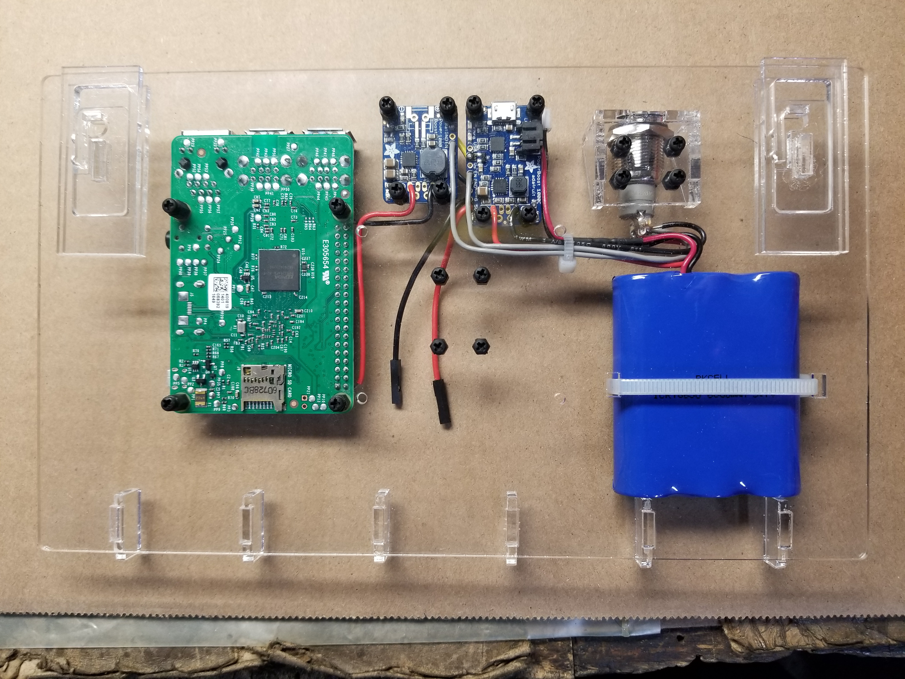
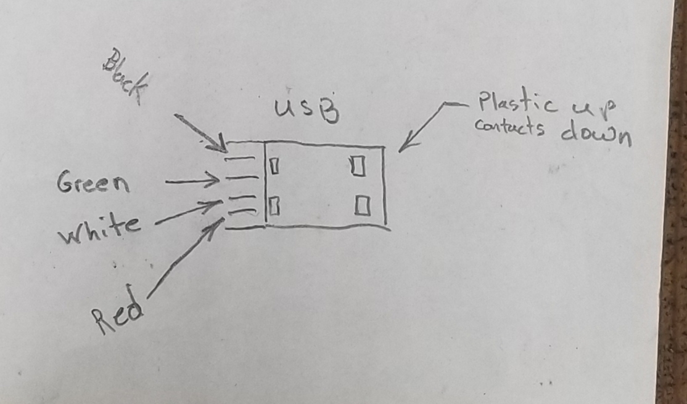
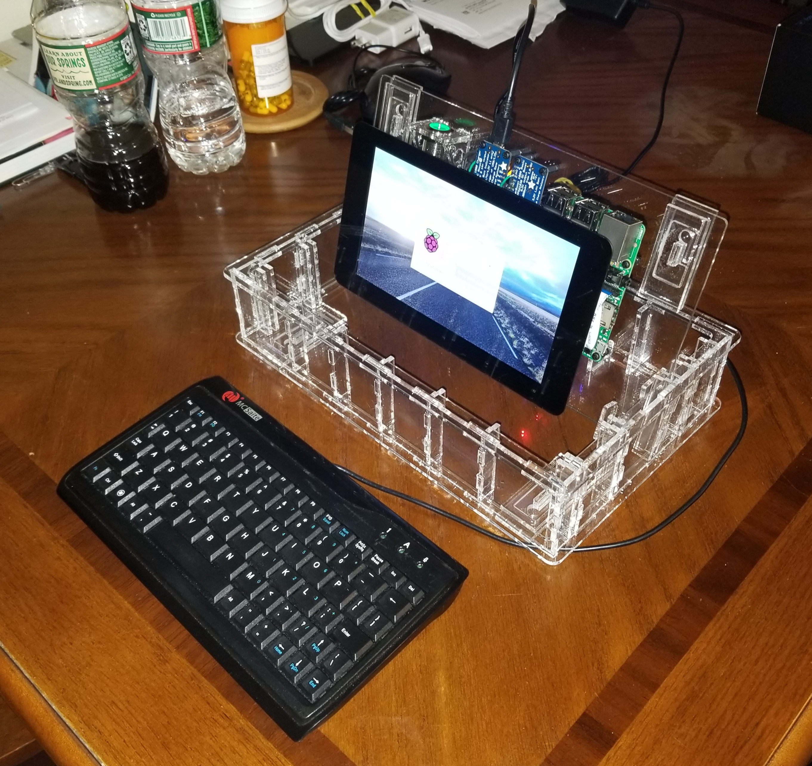

Wiring instructions here  
[Click here to return to the PrivateKeyVault main page for software installation instructions](https://github.com/johnshearing/PrivateKeyVault#privatekeyvault---make-instructions)  
**Or continue reading below for wiring instructions**  

  

Above is what the finished wiring job will look like.  
A wiring diagram will be given further below.  

  

  

This photo shows just the wires you will be soldering.  
The wires are routed slightly differently compared with the photo above.  
It doesn't matter how your route them as long as you do your best to keep the wires short.  

  

  

This photo shows the wires you will be soldering from the other side.  

  

  

In this photo we see 16 standoffs which are threaded 2.5 mm and are 6 mm long.  
These standoffs are fastened to the lid with 2.5 mm screws which are also 6 mm long.  
Circuit boards will be fastend to the standoffs with 2.5 mm screws 4 mm long.  
[The standoffs, screws, and other parts can be found in this kit](https://www.adafruit.com/product/3299)  
PrivateKeyVault has no finacial relationship with the vendor.  

Also shown is the switch mount fastened to the lid with 2.5 mm screws 10 mm long and 2.5 mm nuts  
These are also found in the kit linked above.  

Notice that four holes are left empty. The touch screen will be fastened with these later.  

Also notice that the chemically welded tabs are facing up so that the lid is laying flat on the table.  
That will ensure that the standoffs and switch mount are inside the box when the lid is closed and latched.  

  

  

In this photo we see all the parts except the touch screen are mounted.  
We can't mount the touch screen until all the soldering is done.  

The battery plugs into the side of the charger board when you are ready to energize the Vault.  
You can see this connection in the very first photo.  

Also seen in the very first photo:  
I shortened the red and black battery cables by cutting a section of wire out of each and then soldered them back together.  
You will need 1/16 inch diameter heat shrink tubing to cover the solder joints.  
**Danger**  
**Don't cut the wires at the same time or you will short out the battery and cause a dangerous arc.**  
**Instead, cut one wire to shorten it, solder it back together, and heat shrink the wire to safely cover the solder joint.**  
**Then it will be safe to do the same with the other wire.**  

The reason I did this is because the raspberry pi is very sensitive to voltage drops and longer power cables cause a larger voltage drop. For the same reason I used relatively thick 20 gage wire for all the power and ground connections.  
Don't fail to take these precautions or your Vault will not work reliably.  

Also, when you are ready to charge the battery or power the Vault, the AC power supply plugs into the top of the charger board right next to the connector where the battery plugs in. 

Notice the camera mounted in the center of the lid.  
For some reason two of the holes are smaller than 2.5 mm so I drilled these out with a .093" or 3/32" drill bit.  

Finally, take notice of how the ribbon cable is folded to fit into the receptical on the raspberry pi.  
It is necessary to do this so that the touch screen will fit on top without any interference.  

  

  

In this photo we see how the ribbon cable is inserted into the pi.  

  

  

In this photo the lid has been flipped over so that you can see how the touch screen is mounted.  
You will need (Qty 4) 2.5 mm standoffs which are 23 mm long.  
The touch screen comes with (Qty 4) 12 mm long standoffs.  
You can purchase (Qty 4) [11 mm long standoffs here.](https://www.adafruit.com/product/2336)  
Screw these together to come up with the 23 mm of length needed.  
This length allows you to close the lid over the keyboard with just the right amount of pressure on the keys to keep it from moving around in the box.  

Notice the camera in the very center of the lid still has it's protective tab over the lens.  
Later after we apply power, we will need to focus the camera to a length of 3 1/8 inches from lens to subject.  
This is the perfect focal length for passing qr-codes from a smartphone into the PrivateKeyVault.  

  

  

Solder the wires according to the diagram given further below.  

To start out, solder a 6 in long piece of 20 gage [red](https://www.newark.com/webapp/wcs/stores/servlet/ProductDisplay?catalogId=10001&langId=-1&urlRequestType=Base&partNumber=68X4831&storeId=10194) and [black](https://www.newark.com/webapp/wcs/stores/servlet/ProductDisplay?catalogId=10001&langId=-1&urlRequestType=Base&partNumber=68X4829&storeId=10194) wire to the (+ and -) connections as shown in the photo above.  
These go to the lighted switch as you can see in this document's very first photo.  

Then cut a 3 in piece of special [red and black jumper wires](https://www.sparkfun.com/products/11710) and solder them to the 5v and Gnd connections as shown in the photo above.  
These are not your typical jumper wires.  
Not shown in this photo, these wires have a connector crimped at the ends.  
You can see the crimp connectors in the next photo and also in the second photo of this document.  
Also these jumpers are made from 20 gage wire which is thicker than wire ordinarily used to make jumper wires of this type.  
So there is less voltage drop across these wire compared with normal jumper wires.  
This really matters.   
Do not fail to purchase these special jumper wires for your project.  
These will connect to the touch screen by sliding the connectors onto the 5v pin for the red wire and GND pin for the black wire.  
The red connection to the touch screen is visible in the very first photo of this document if you look carefully. The black jumper wire is not visible in that photo but you will know it because it is marked GND.  

Finally, solder a grey wire about 6 inches long to the connection marked EN for enable.  
This wire will go to the lighted switch as seen in this document's very first photo.  

  

  

Sorry about the dirty fingers - should have hired a hand model.  
In any case, flip the charger board over.  
Notice the black wire at GND and yellow wire at LiPo.  
These wire are 20 gage. Thick wires are required to avoid an unacceptable voltage drop.  
I used 3 inch long pieces of wire cut from the package of special jumpers we used in the previous step.  
Notice that these two wires are inserted into the board from bottom where as the wires in the previous step were inserted from the top.  
The black wire will go into the connection marked GND and the yellow wire will go into the connnection marked LiPo.  
Solder the wires in place.  
Later you can mount the board back onto the lid and cut the lengths of the wires so that they are just long enough to reach the GND and Bat connections on the smaller boost board. Then you can unmount the boards and solder the wires to the board. Make sure the wires are just long enough so that mounting the boost boards back on to the acrylic lid will not be difficult.   

Now referring the the very first photo in this document and to the wiring diagram below, solder a 6 inch length of red, black, and grey wire as shown into the smaller boost board. The red wire will go to the 5 Volt GPIO pin on the raspberry pi. The black wire will go to a ground pin on the raspberry pi. And the grey wire will go to the lighted switch. All of this is shown in the wiring diagram which is the next photo below. Please note that the wiring diagram seems to indicate that the wires are soldered to the side of the board shown in the diagram. Actually they are soldered to the other side where GPIO pins extend for this purpose. This is made clear in the first photo.    

   

    

This diagram shows all the wires and their terminal points for soldering but looking at the very first photo in this document will give you a better idea of how to run the wires.  

  

    

The cable for the keyboard as it came from the vendor was too long to fit in the box. Furthermore, all that extra length was inconvenient to manage when using the device. So I cut the wire to a length of 26 inches from keyboard to the end of the wire. The above wiring diagram shows how to solder the wires to a new USB connector [Which can be ordered here](https://www.adafruit.com/product/1827). This connector has a very thin profile which will matter when you are plugging several devices into the USB ports during the SD card cloning process.  

Next time I make one I will take photos and post them here.  
Opps I forgot to show a fifth sheild/ground wire in the drawing. That must be soldered to the case of the connector. I will take a photo of that next time too.   

The wire measures about .103 inches in diameter so in the next build I put slots into all the uprights to make it easier to tuck away the wire. A slot .100 inches wide provided enough friction to keep the wire in place. This is not shown in the photos but the feature is included in the CorelDraw files so you will have this feature when you cut the parts.  

  

  

If you happen to have an SD card already loaded with the Raspbian operating system then you may want to fire up your PrivateKeyVault now. Otherwise this step is covered later. If you have a card with operating system installed then go ahead and put in the SD card and press the power button. It should look something like the picture above.  

**Warning**  
When shutting down: 
Always shutdown with the menu option and wait 15 second before pressing off the power button.  
**If you fail to do this then you may ruin your SD card.**  
I hope you have a backup.  
I will incorperate inteligent power management in future builds.  

  

If you happen to have an SD card already loaded with the Raspbian operating system then you may want to focus the camera now. Otherwise this step is covered later.  
You will need to focus the camera. This is because you will be using the camera to take pictures and videos of qr-codes on your phone which will be held about 3 1/8 inches from your camera. This really matters if you are using the camera to read qr-codes. You simply will not be able to read qr-codes with your camera if it is not focused for a distance of 3 1/8 inches.  

    

You will need to remove the touch screen in order to remove the camera and then temporarily put it back together as show in the photo above in order to focus the camera.  

When you have the Vault powered up again in this new configuration execute the following command at the terminal window to set up the camera focus  
`raspistill -t 0`  
Now the touchscreen will show what the camera sees.  
Adjust the focus to about 3 1/8 inches as measured from lens to object.  
The next photo shows how to make the adjustment.  

  

    

The focus comes set at infinity.  
Small sharp sissors are good for turning the retaining ring.  
Counter clock wise moves the focus closer. Counter clockwise is the direction you need to turn the ring.  
Some of the cameras come from the vendor with a dot of glue on the retaining ring to keep the focus set at infinity.  
If the dot of glue is present then some force will be required to break the dots of glue that hold the retaining ring in place.  
Keep turning the retaining ring and checking focus until focus is sharp at 2 3/8 inches.  
When focus is good shut down at the menu, wait 15 seconds, power off at the push button switch, and then remount the camera at it's normal position.   
To see what is possible with raspistill execute `raspistill --help`  

  

[Click here to return to the PrivateKeyVault main page for wiring and software installation instructions](https://github.com/johnshearing/PrivateKeyVault#privatekeyvault---make-instructions) 
