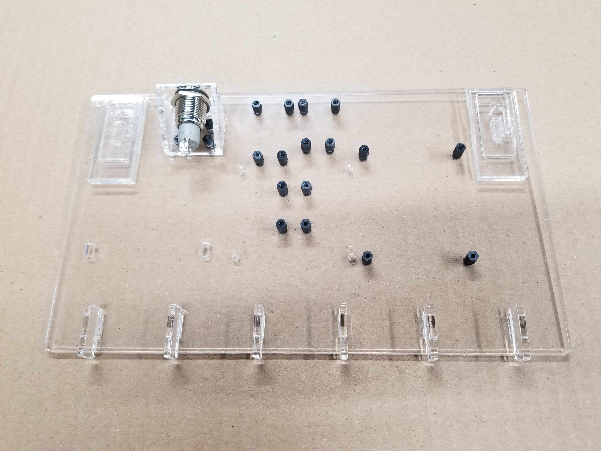
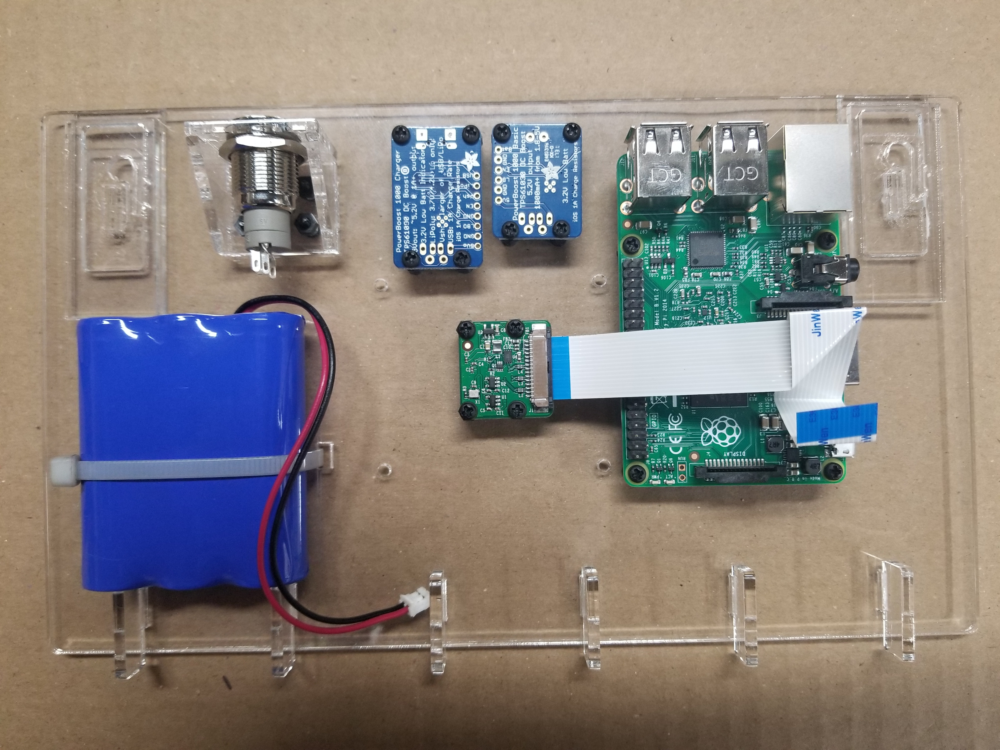
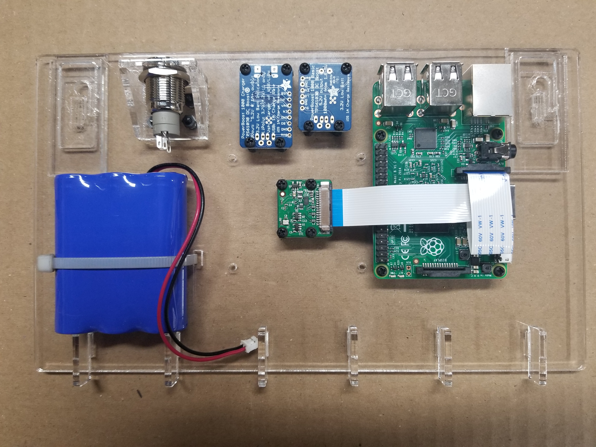
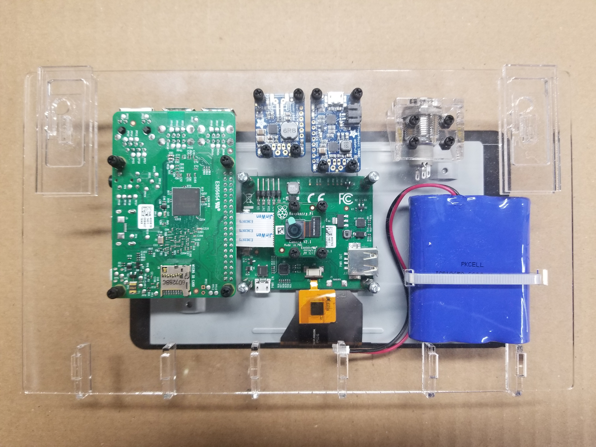
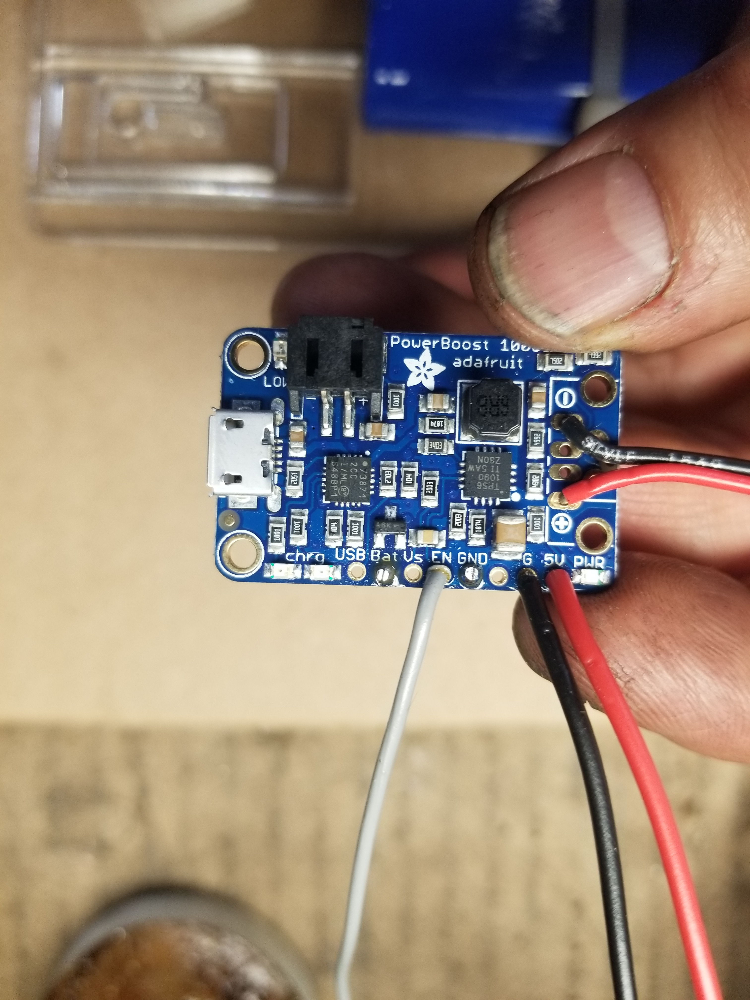
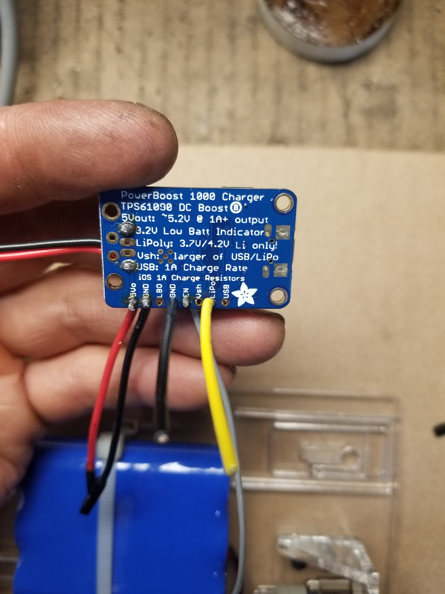

Wiring instructions here

  

This is what the finished wiring job will look like.  
A wiring diagram will be given further below.  

  

  

In this photo we see 16 standoffs which are threaded 2.5 mm and are 6 mm long.  
These standoffs are fastened to the lid with 2.5 mm screws which are also 6 mm long.  
[The standoffs, screws, and other parts can be found in this kit](https://www.adafruit.com/product/3299)  
PrivateKeyVault has no finacial relationship with the vendor.  

Also shown is the switch mount fastened to the lid with parts found in the kit linked above.  

Notice that four holes are left empty. The touch screen will be fastened with these later.  

Also notice that the chemically welded tabs are facing up so that the lid is laying flat on the table.  
That will ensure that the standoffs and switch mount are inside the box when the lid is closed and latched.  

  

  

In this photo we see all the parts except the touch screen are mounted.  
We can't mount the touch screen until all the soldering is done.  

The battery plugs into the side of the charger board when you are ready to energize the Vault.  

I didn't show it in the photo above, but I actually shortened the red and black battery cables by cutting a section of wire out of each and then soldering them back together.  
**Danger**  
**Don't cut the wires at the same time or you will short out the battery and cause a dangerous arc.**  
**Instead, cut one wire to shorten it and then solder it back together and heat shrink the wire to safely cover the solder joint.**  
**Then it will be safe to do the same with the other wire.**  

The reason I did this is because the raspberry pi is very sensitive to voltage drops and longer power cables cause a larger voltage drop. For the same reason I used relatively thick 20 gage wire for all the power and ground connections. 

Also, when you are ready to charge the battery or power the Vault the AC power supply plugs into the top of the charger board.  

Notice the camera mounted in the center of the lid.  
For some reason two of the holes are smaller than 2.5 mm so I drilled these out with a .093" drill bit.  

Finally, take notice of how the ribbon cable is folded to fit into the receptical on the raspberry pi.  
It is necessary to do this so that the touch screen will fit on top without any interference.  

  

  

In this photo we see how the ribbon cable is inserted into the pi.  

  

  

In this photo the lid has been flipped over so that you can see how the touch screen is mounted.  
You will need a 2.5 mm standoff which is 23 mm long.  
The touch screen comes with an 11 mm long stand off and the hardware kit linked above has some 12 mm long standoffs included.  
So I screw these together to come up with the 23 mm of length needed.  
This length allows you to close the lid over the keyboard with just the right amount of pressure on the keys to keep it from moving around in the box.  
For the next build I am going to look for steel hardware of the correct length for all the hardware parts.  

Notice the camera in the very center of the lid still has it's protective tab over the lens.  
Later after we apply power, we will need to focus the camera to a length of 2 3/8 inches from lens to subject.  
This is the perfect focal length for passing qr-codes from a smartphone into the PrivateKeyVault.  

  

  

Solder the wires according to the diagram given further below.  

To start out, solder a 6 in long piece of 20 gage [red](https://www.newark.com/webapp/wcs/stores/servlet/ProductDisplay?catalogId=10001&langId=-1&urlRequestType=Base&partNumber=68X4831&storeId=10194) and [black](https://www.newark.com/webapp/wcs/stores/servlet/ProductDisplay?catalogId=10001&langId=-1&urlRequestType=Base&partNumber=68X4829&storeId=10194) wire to the (+ and -) connections as shown in the photo above.  
These go to the lighted switch as you can see in this document's very first photo.  

Then cut a 3 in piece of special [red and black jumper wires](https://www.sparkfun.com/products/11710) and solder them to the 5v and Gnd connections as shown in the photo above.  
These are not your typical jumper wires. Not shown in the photo, these wires have a connector crimped at the ends. Also these jumpers are made from 20 gage wire which is thicker than wire ordinarily used to make jumper wires. So there is less voltage drop across them. This really matters.   
These will connect to the touch screen by sliding the connectors onto the 5v pin for the red wire and GND pin for the black wire.  
The red connection to the touch screen is visible in the very first photo of this document if you look carefully. The black jumper wire is not visible in that photo you will know it because it is marked GND. 

  

  

Now flip the charger board over and ...

 

